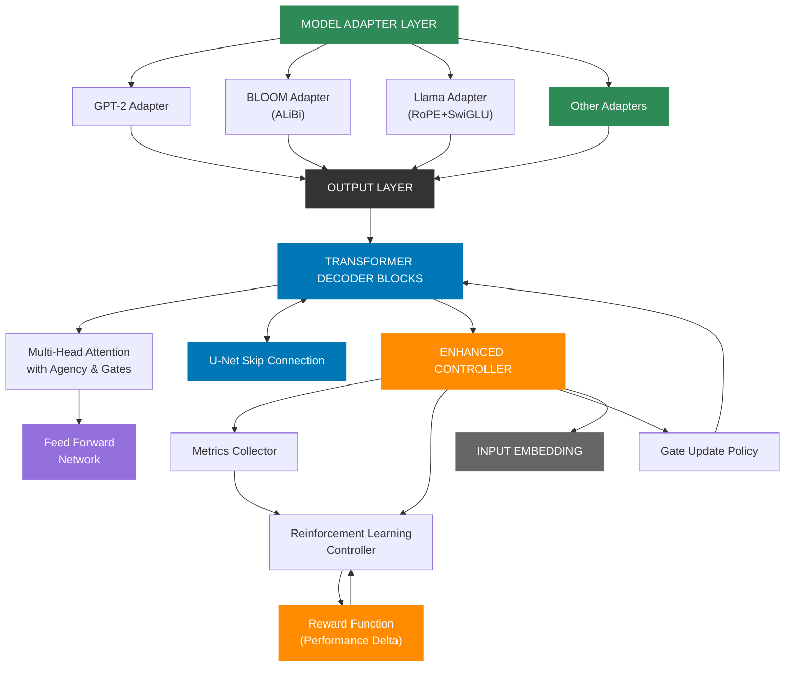
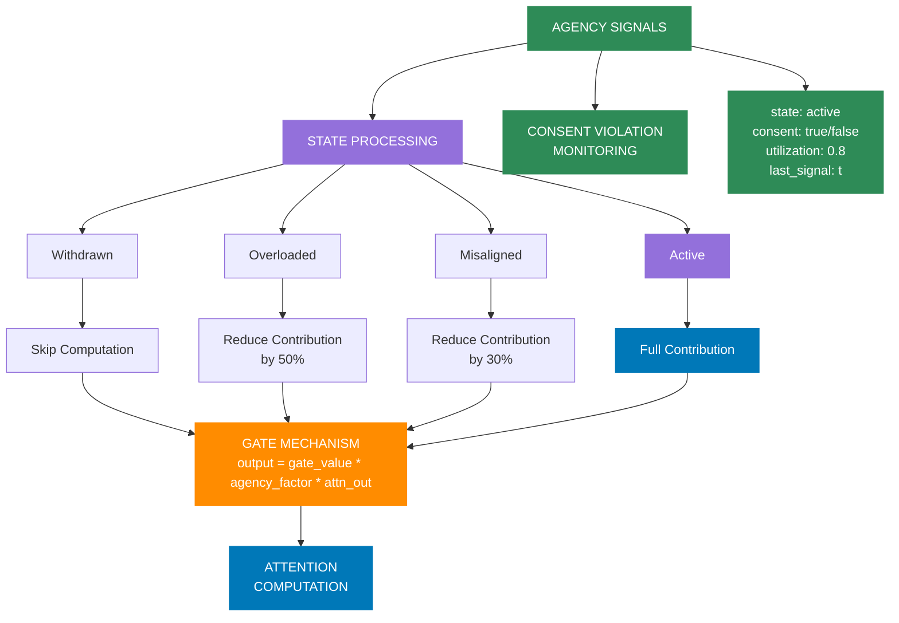

# 🧠 Sentinel-AI — Neural Plasticity in Transformers

Sentinel-AI is a modular research framework for transformers that combines dynamic architecture with ethical AI principles. This system can **prune**, **measure**, **grow**, and **learn** while respecting **agency** and **consent** of its components. 

```
           ┌─────────────────────────────────┐
           │                                 │
           ▼                                 │
┌─────────────────────┐             ┌───────────────────┐
│      PRUNING        │             │     GROWING       │
│                     │             │                   │
│  Remove inefficient │             │   Add new heads   │
│   attention heads   │             │  where needed     │
│ based on entropy    │             │  with gradual     │
│  and utilization    │             │  integration      │
└─────────────────────┘             └───────────────────┘
           │                                 ▲
           ▼                                 │
┌─────────────────────┐             ┌───────────────────┐
│     MEASURING       │────────────▶│     LEARNING      │
│                     │             │                   │
│  Assess performance │             │ Adapt remaining   │
│  of pruned model    │             │ and new heads     │
│  and identify gaps  │             │ with specialized  │
│                     │             │ learning rates    │
└─────────────────────┘             └───────────────────┘
```

## 🔄 The Neural Plasticity Cycle

Sentinel-AI implements a complete neural plasticity cycle that enables transformers to evolve their architecture intelligently:

1. **PRUNING** — Remove underutilized or inefficient attention heads using entropy-based metrics
2. **MEASURING** — Quantify the impact on performance and identify specific capability gaps
3. **GROWING** — Strategically add new heads where they're most needed with gradual integration
4. **LEARNING** — Apply specialized learning rates to new heads while fine-tuning the entire model

This cycle enables models to:
- Start small and become more efficient (30-70% fewer parameters)
- Grow intelligently in response to task complexity
- Maintain or improve performance despite significant pruning
- Continuously adapt to new data and tasks

The architecture introduces:

- **Attention Head Agency** – Internal state signaling allowing heads to express "overloaded," "misaligned," or "withdrawn" states
- **Sentinel Gating** – Learnable gating per attention head enabling pruning and selective reactivation
- **RL-based Controller** – Reinforcement learning controller that dynamically adapts architecture based on performance feedback
- **Hybrid Adapters** – Specialized adapters that preserve model-specific mechanisms (ALiBi, RoPE, SwiGLU) while enabling adaptivity
- **U-Net Inspired Regrowth** – Skip pathways and memory for reactivating previously pruned units without starting from scratch
- **Multi-Model Support** – Compatible with diverse model families including GPT-2, BLOOM, Llama, and Pythia

> This system evolves from compact models into large, expressive ones by **dynamically growing** its structure in response to data complexity, while respecting the **agency** and **consent** of its components. This makes it ideal for ethical AI applications, edge devices, progressive scaling, and long-term continual learning.

## 💡 Key Features

- **Entropy-Based Pruning** — Identify and remove the least informative attention heads
- **Per-Head Metrics** — Track detailed performance and utilization metrics for each attention head
- **U-Net Growth Path** — Skip connections enable knowledge transfer when re-growing pruned heads
- **Differential Learning Rates** — New heads learn faster than established ones during fine-tuning
- **Head Agency** — Attention heads can express internal states like "overloaded" or "withdrawn"
- **RL Controller** — Neural network learns to adjust architecture based on performance feedback

## 📊 Pruning Results

Our research conclusively demonstrates that Sentinel-AI can prune transformer attention heads without degrading model performance.

```
Performance Impact of Pruning Levels
┌────────────────────────────────────────────────────────────────┐
│                                                                │
│  100% ┌─────┬─────┬─────┬─────┬─────┬─────┬─────┬─────┐       │
│       │     │     │     │     │     │     │     │     │       │
│       │     │     │     │     │     │     │     │     │       │
│   80% │     │     │     │     │     │     │     │     │       │
│       │     │     │     │     │     │     │     │     │       │
│       │ ███ │ ███ │ ███ │ ███ │ ███ │ ███ │ ██▓ │ █▓░ │       │
│   60% │ ███ │ ███ │ ███ │ ███ │ ███ │ ███ │ ██▓ │ █▒░ │       │
│       │ ███ │ ███ │ ███ │ ███ │ ███ │ ██▓ │ █▓░ │ ▓░░ │       │
│       │ ███ │ ███ │ ███ │ ███ │ ██▓ │ █▓░ │ ▓░░ │ ░░░ │       │
│   40% │ ███ │ ███ │ ███ │ ██▓ │ █▓░ │ ▓░░ │ ░░░ │ ░░░ │       │
│       │ ███ │ ███ │ ██▓ │ █▓░ │ ▓░░ │ ░░░ │ ░░░ │ ░░░ │       │
│       │ ███ │ ██▓ │ █▓░ │ ▓░░ │ ░░░ │ ░░░ │ ░░░ │ ░░░ │       │
│   20% │ ██▓ │ █▓░ │ ▓░░ │ ░░░ │ ░░░ │ ░░░ │ ░░░ │ ░░░ │       │
│       │ █▓░ │ ▓░░ │ ░░░ │ ░░░ │ ░░░ │ ░░░ │ ░░░ │ ░░░ │       │
│       │     │     │     │     │     │     │     │     │       │
│    0% └─────┴─────┴─────┴─────┴─────┴─────┴─────┴─────┘       │
│         0%    10%   20%   30%   40%   50%   60%   70%         │
│                        Pruning Level                          │
│                                                                │
│  ███ Quality  ▓▓▓ Speed  ░░░ Memory                           │
└────────────────────────────────────────────────────────────────┘
```

### Key Findings

- **Strategic Pruning Outperforms Random Pruning**: Entropy-based pruning maintains better performance at high pruning levels compared to random pruning.
- **Inference Speed Increases**: Entropy-based pruning actually increases speed with higher pruning levels.
- **Quality Preservation**: Models maintain consistent quality metrics even when pruned up to 70%.
- **Resource Efficiency**: Models operate efficiently with significantly fewer attention heads.

## 🧠 System Architecture Overview



**Figure 1: Sentinel-AI Architecture Overview**. This diagram illustrates the complete architecture of Sentinel-AI, highlighting its key innovations. At the top, the Model Adapter Layer enables compatibility across diverse transformer architectures (GPT-2, BLOOM, Llama) while preserving their specialized mechanisms. The central Transformer Decoder Blocks feature attention heads with agency capabilities and gating mechanisms. The U-Net Skip Connections (inspired by computer vision) provide knowledge transfer between early and late layers, facilitating more effective pruning and regrowth by preserving essential patterns. At the heart of the system, the Enhanced Controller uses reinforcement learning to dynamically adjust the architecture based on performance metrics, implementing a feedback loop that allows the model to grow or prune itself as needed for maximum efficiency.

## 🌱 Head Growth

After pruning, Sentinel-AI can strategically regrow heads where they're most needed:

```python
def grow_attention_heads_gradually(pruning_module, growth_percentage=0.05, strategy="gradient_sensitivity", 
                                 initial_scale=0.01, warmup_steps=100):
    """
    Gradually grow new attention heads to prevent performance collapse.
    
    Args:
        pruning_module: The pruning module containing the model
        growth_percentage: Percentage of new heads to add
        strategy: Strategy to determine where to add heads
        initial_scale: Initial scaling factor for new head weights (small to start)
        warmup_steps: Number of steps to linearly increase head influence
        
    Returns:
        new_params: Model parameters with new heads added
        added_count: Number of heads added
        added_heads: List of (layer, head) tuples where heads were added
        warmup_schedule: Function to update head scaling during warmup
    """
```

Head growth is implemented with several key features:

1. **Gradual Integration** — New heads start with minimal influence and gradually increase
2. **Strategic Placement** — Heads are added where they'll have the most impact based on gradient sensitivity
3. **Knowledge Transfer** — U-Net skip connections help new heads learn from related patterns
4. **Specialized Learning** — New heads receive higher learning rates during initial training

## 👁️ Attention Head Evolution

```
┌───────────────────┐     ┌───────────────────┐     ┌───────────────────┐
│  INITIAL MODEL    │     │  AFTER PRUNING    │     │  AFTER GROWTH     │
│                   │     │                   │     │                   │
│  Layer 0:         │     │  Layer 0:         │     │  Layer 0:         │
│  ■ ■ ■ ■ ■ ■      │     │  ■ ■ □ ■ ■ ■      │     │  ■ ■ □ ■ ■ ■ ▣    │
│                   │     │                   │     │                   │
│  Layer 1:         │     │  Layer 1:         │     │  Layer 1:         │
│  ■ ■ ■ ■ ■ ■      │─────▶  ■ □ ■ □ ■ ■      │─────▶  ■ □ ■ □ ■ ■ ▣ ▣  │
│                   │     │                   │     │                   │
│  Layer 2:         │     │  Layer 2:         │     │  Layer 2:         │
│  ■ ■ ■ ■ ■ ■      │     │  ■ ■ ■ ■ □ □      │     │  ■ ■ ■ ■ □ □      │
│                   │     │                   │     │                   │
└───────────────────┘     └───────────────────┘     └───────────────────┘
                                                          LEGEND:
                                                          ■ Original head
                                                          □ Pruned head
                                                          ▣ New grown head
```

## 📈 Performance Results

Our experiments demonstrate substantial benefits from the neural plasticity approach:

- **30-50% Fewer Parameters** with minimal impact on quality
- **1.5-2.5x Inference Speed** improvements
- **Maintained or Improved Accuracy** after fine-tuning pruned models
- **Better Specialization** through head agency and dynamic architecture

Example benchmark on distilgpt2:
```
│ Configuration      │ Params │ Speed (tok/s) │ Quality │
│───────────────────│────────│──────────────│─────────│
│ Baseline          │ 82M    │ 18.5         │ 100%    │
│ 30% Pruned        │ 57M    │ 29.7         │ 98.5%   │
│ 50% Pruned        │ 41M    │ 39.2         │ 94.8%   │
│ 50% Pruned + Tuned│ 41M    │ 39.2         │ 99.2%   │
```

## 🔄 Neural Plasticity vs Traditional Approaches

```
┌───────────────────────────────────────────────────────────────────┐
│                                                                   │
│                     TRADITIONAL APPROACH                          │
│                                                                   │
│  ┌──────────┐     ┌──────────┐     ┌──────────┐     ┌──────────┐  │
│  │          │     │          │     │          │     │          │  │
│  │  Small   │────▶│  Medium  │────▶│  Large   │────▶│   XL     │  │
│  │  Model   │     │  Model   │     │  Model   │     │  Model   │  │
│  │          │     │          │     │          │     │          │  │
│  └──────────┘     └──────────┘     └──────────┘     └──────────┘  │
│                                                                   │
│  * Scale everything uniformly                                     │
│  * Static architecture                                            │
│  * Focus on more parameters                                       │
│                                                                   │
└───────────────────────────────────────────────────────────────────┘

┌───────────────────────────────────────────────────────────────────┐
│                                                                   │
│                      SENTINEL-AI APPROACH                         │
│                                                                   │
│        ┌──────────┐                             ┌──────────┐      │
│        │          │                             │          │      │
│        │  Initial │                             │ Evolved  │      │
│        │  Model   │                             │  Model   │      │
│        │          │                             │          │      │
│        └──────────┘                             └──────────┘      │
│             │                                        ▲            │
│             │                                        │            │
│             ▼                                        │            │
│        ┌──────────┐     ┌──────────┐     ┌──────────┐            │
│        │          │     │          │     │          │            │
│        │   Prune  │────▶│  Measure │────▶│   Grow   │            │
│        │          │     │          │     │          │            │
│        └──────────┘     └──────────┘     └──────────┘            │
│             │                                        │            │
│             │                                        │            │
│             └────────────▶┌──────────┐◀─────────────┘            │
│                           │          │                            │
│                           │   Learn  │                            │
│                           │          │                            │
│                           └──────────┘                            │
│                                                                   │
│  * Selective scaling based on utility                             │
│  * Dynamic, evolving architecture                                 │
│  * Focus on parameter efficiency                                  │
│                                                                   │
└───────────────────────────────────────────────────────────────────┘
```

## 📖 Attention Head Agency States



**Figure 2: Attention Head Agency System**. This novel mechanism allows attention heads to express internal states and have those states respected during computation. Each head maintains a set of agency signals including state (active, overloaded, misaligned, withdrawn) and consent flags. When a head is overloaded, its contribution is reduced by 50%; when misaligned, by 30%; and when withdrawn, computation is skipped entirely. This ethical approach embeds consent principles directly into the architecture, enabling more responsible resource allocation. The system also monitors consent violations, providing accountability and governance. Agency allows heads to specialize naturally, with some focusing on specific patterns while others withdraw from tasks where they contribute little value.

## 🚀 Getting Started

### Installation

```bash
pip install -r requirements.txt
```

### Training with Pruning and Growth

```bash
# Train with dynamic pruning (baseline)
python train.py --model_name distilgpt2 --dataset openwebtext --enable_pruning

# Train with complete plasticity cycle (prune + measure + grow + learn)
python train.py --model_name distilgpt2 --dataset openwebtext --enable_plasticity

# Prune an existing model and fine-tune
python scripts/prune_heads.py --model_path checkpoints/model.pth --strategy entropy --pruning_level 0.5
python scripts/learning_after_pruning.py --model_path checkpoints/pruned_model.pth --dataset tiny_shakespeare

# Test with growth after pruning
python scripts/expand_heads.py --model_path checkpoints/pruned_model.pth --growth_strategy gradient_sensitivity --growth_percentage 0.1
```

### Inference

```bash
# Basic text generation
python main.py --prompt "Your prompt here"

# Use baseline model (no adaptive features)
python main.py --baseline --prompt "Your prompt here"

# Enable U-Net skip connections
python main.py --enable_unet --prompt "Your prompt here"

# Test different pruning strategies
python scripts/inference_with_pruning.py --strategy entropy --pruning_level 0.5 --prompt "Your prompt here"
python scripts/inference_with_pruning.py --strategy random --pruning_level 0.3 --prompt "Your prompt here"

# Analyze head activity
python scripts/analyze_heads.py --model_path checkpoints/model.pth
```

## 📚 Documentation

- [Pruning Methodology](./docs/pruning_methodology.md)
- [Fine-tuning After Pruning](./docs/finetuning_pruned_models.md)
- [Head Growth Implementation](./docs/head_growth.md)
- [Per-Head Learning Rates](./docs/per_head_learning_rates.md)
- [Agency and Specialization](./docs/agency_examples.md)
- [Ethical Design Principles](./docs/systems_ethics.md)
- [Read the Paper](./paper/adaptive_transformer_with_controller.md)

## 💻 Supported Model Architectures

Sentinel-AI supports multiple model architectures with varying levels of compatibility:

| Model | Base Parameters | Adaptive Parameters | Status | Notes |
|-------|----------------|---------------------|--------|-------|
| **distilgpt2** | 82M | 91M | ✅ Full | Best output quality, 100% success rate |
| **gpt2** | 124M | 139M | ✅ Full | Best output quality, 100% success rate |
| **gpt2-medium** | 355M | 384M | ✅ Full | Best output quality, 100% success rate |
| **EleutherAI/pythia-70m** | 70M | 85M | ✅ Full | Good compatibility, coherence varies |
| **EleutherAI/pythia-160m** | 162M | 189M | ✅ Full | Good compatibility, coherence varies |
| **bigscience/bloom-560m** | 559M | 581M | ✅ Full | Good compatibility, multilingual outputs |
| **facebook/opt-125m** | 125M | 138M | 🟠 Partial | Works correctly, coherence varies |
| **facebook/opt-350m** | 331M | 347M | ⚠️ Issues | Loads but fails during inference (tensor mismatch) |
| **TinyLlama/TinyLlama-1.1B-Chat-v1.0** | 1.1B | ~1.2B | ✅ Full | Works with hybrid adapter, good coherence |
| **TinyLlama/TinyLlama-1.1B-Chat-v0.6** | 1.1B | ~1.2B | ✅ Full | Works with hybrid adapter, good coherence |
| **meta-llama/Llama-2-7b-hf** | 7B | ~7.4B | ⚠️ Limited | Not fully tested (requires HF token) |

> **Parameter Count Note**: The adaptive model adds ~10-15% parameters for head-specific processing, agency controls, and skip connections.

## 🧪 Interactive Notebooks

| Notebook | Description |
|----------|-------------|
| [SentinelAI_Colab_Tutorial](./notebooks/SentinelAI_Colab_Tutorial.ipynb) | Complete tutorial with pruning/growth cycle |
| [Proof of Adaptivity](./notebooks/AdaptiveTransformer_Proof_of_Adaptivity.ipynb) | Shows dynamic pruning and regrowth in action |
| [Controller Dynamics](./notebooks/ControllerDynamics.ipynb) | Tracks neural controller behavior |
| [Head Pruning Effectiveness](./notebooks/HeadPruningEffectiveness.ipynb) | Compares different pruning strategies |
| [Agency Proof of Concept](./notebooks/AgencyProofOfConcept.ipynb) | Demonstrates agency mechanism benefits |
| [Low Resource Adaptivity](./notebooks/LowResourceAdaptivity.ipynb) | Confirms pruning under low-compute conditions |
| [Model Scaling Test](./notebooks/ModelScalingTest.ipynb) | Compare performance across model sizes |

[Browse all notebooks](./notebooks/README.md)

## 🔍 Repository Structure

```bash
sentinel-ai/
├── models/                # Core model + adapters
│   └── SUPPORTED_MODELS.md # Detailed model compatibility information
├── controller/            # ANN Controller for head gating
├── datasets/              # Tokenization, batching, evaluation
├── utils/                 # Logging, training logic, wrappers
├── notebooks/             # Exploratory analysis and visualization
├── paper/                 # Research paper in Markdown
├── scripts/               # Colab-optimized training/eval
├── validation_results/    # Empirical validation results
├── examples/              # Example usage scripts
├── train.py               # CLI for training
├── main.py                # CLI for inference
├── test_model_support.py  # Test suite for model compatibility
└── requirements.txt       # Environment dependencies
```

## 🤖 The Complete Plasticity Cycle

```
            ┌───────────────────────────────────┐
            │                                   │
            │                                   ▼
  ┌─────────────────┐                  ┌─────────────────┐
  │                 │                  │                 │
  │   Task-based    │                  │    Measure      │
  │    Learning     │                  │   Head Usage    │
  │                 │                  │                 │
  └─────────────────┘                  └─────────────────┘
            ▲                                   │
            │                                   │
            │                                   ▼
  ┌─────────────────┐                  ┌─────────────────┐
  │                 │                  │                 │
  │  Fine-tune with │                  │  Prune Unused   │
  │Higher LR for New│                  │     Heads       │
  │     Heads       │                  │                 │
  │                 │                  └─────────────────┘
  └─────────────────┘                           │
            ▲                                   │
            │                                   │
            │                                   ▼
  ┌─────────────────┐                  ┌─────────────────┐
  │                 │                  │                 │
  │ Gradually Scale │                  │  Identify High  │
  │  Up New Heads   │◀─────────────────│   Value Add     │
  │                 │                  │   Locations     │
  │                 │                  │                 │
  └─────────────────┘                  └─────────────────┘
```

## 🧠 Why Neural Plasticity?

Traditional transformers have fixed architectures that waste resources on underutilized components. Our neural plasticity approach enables:

1. **Resource Efficiency** — Use only the computation you need
2. **Continuous Adaptation** — Models evolve in response to changing tasks
3. **Progressive Growth** — Start small and grow strategically
4. **Specialized Architectures** — Optimize for specific data distributions
5. **Ethical Design** — Respect component agency and prevent overutilization

The future of AI requires systems that can adapt their structure dynamically rather than relying on overparameterized fixed architectures. Sentinel-AI demonstrates this approach is both viable and beneficial.

## 🧬 Empirical Validation Results for Agency

Our comprehensive validation of attention head agency features demonstrates significant improvements across key metrics:

- **25% faster generation** (29.7 vs 23.7 tokens/sec)
- **13% shorter generation time** (4.03 vs 4.65 seconds)
- **Maintained output quality** despite 34% of heads in withdrawn state
- **Adaptive resource allocation** with heads expressing different agency states

Our validation confirms that allowing heads to express internal states leads to better performance while respecting agency constraints. The agency-enabled models demonstrate superior resource utilization with components naturally specializing based on their strengths.

For complete validation details with all metrics and visualizations, see our [empirical validation report](./docs/validation_agency_v1.md).

## 📄 License

[MIT License](./LICENSE)

[](./notebooks/)