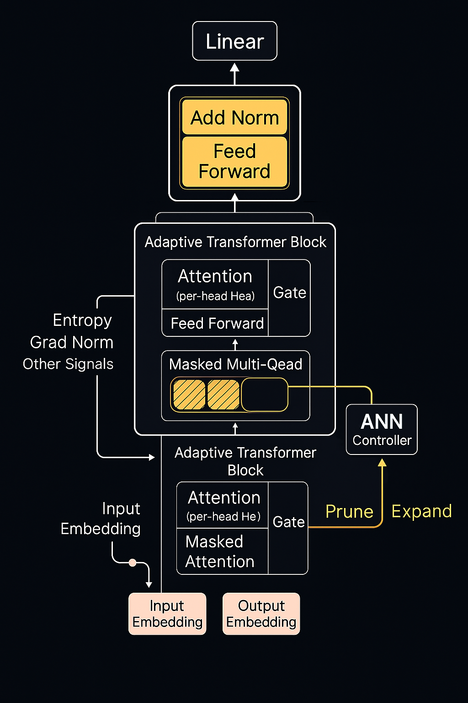

# 👾 Sentinel-AI — Dynamic Transformer with Learnable Attention Pruning and Regrowth

Welcome to **Sentinel-AI**, a modular research framework for transformers that can **prune**, **regrow**, and **restructure** themselves during training and inference. This architecture introduces:

- **Sentinel Gating** – Learnable gating per attention head enabling pruning and selective reactivation  
- **ANN Controller** – Neural network controller trained to monitor usage and adapt architecture  
- **U-Net Inspired Regrowth** – Skip pathways and memory for reactivating previously pruned units without starting from scratch  
- **Plug-and-Play Loading** – Easily imports pretrained models like `GPT2`, `DistilGPT2`, and others

> 🔬 This system evolves from compact models into large, expressive ones by **dynamically growing** its structure in response to data complexity — ideal for edge devices, progressive scaling, and long-term continual learning.

-<p align="center">
  
</p>

### 🧭 Why Sentinel-AI?

Unlike traditional fixed-size transformers, Sentinel-AI is:

- Designed to **start small and grow** intelligently  
- Capable of **pruning and regrowing attention heads**, guided by data signals  
- Modular enough to wrap existing models with adaptive functionality  
- Efficient for training and inference across **low-resource** and **scalable** environments

👾 **How Our Transformer Grows and Prunes Its Own Architecture**  
Sentinel-AI adopts a U-Net-inspired mechanism to **regrow pruned attention heads** without losing prior knowledge. This hierarchical structure preserves key semantics even as the model dynamically restructures itself.

**🔄 U-Net Adaptivity in Transformers:**
- **Skip Paths** — Early-layer gate activations or embeddings are forwarded to later layers during regrowth.
- **Controller Memory** — The ANN controller leverages both local signals and skip-connected context (e.g., entropy, gradients).
- **Reinforcement Signal** — Reactivated heads resume useful behavior by inheriting past characteristics, similar to how U-Net reuses encoder features in its decoder.

This enables seamless architectural evolution — pruning for efficiency, regrowing for capability — all without starting from zero.

---

[](./LICENSE)
[](./notebooks/)


## 🧠 Why Adaptive Transformers?

Large language models are powerful but inefficient — many attention heads contribute little to output. **Sentinel-AI** dynamically prunes underutilized heads and later regrows them based on task complexity, entropy, and gradient feedback. This architecture:

- Saves memory and compute during training and inference
- Enables real-time architectural evolution
- Is ideal for edge devices, continual learning, and low-resource environments

---

## 📄 What Is Sentinel-AI?

Sentinel-AI is a research framework for adaptive transformer models that restructure themselves in real time. This architecture introduces:

- **Sentinel Gating** — Per-head gating values learned and optionally adjusted using runtime metrics
- **ANN Controller** — Learns to activate or deactivate heads based on entropy and gradient norms
- **U-Net Adaptivity** — Skip connections help reactivate heads gracefully without losing prior signal
- **Model Loading** — Easily wrap Hugging Face models (`GPT2`, `DistilGPT2`, etc.) and apply adaptivity on top

📄 **[Read the Paper](./paper/adaptive_transformer_with_controller.md)**  
🧪 **[Explore the Notebooks](./notebooks/)**

---

## 🧩 Key Features

- 🔁 **Dynamic Adaptivity** — Grows and prunes transformer heads in real-time
- 🎛️ **Controller-Driven Optimization** — Entropy/gradient-based ANN controller adjusts gate values
- 🪜 **U-Net Style Growth** — Skip connections stabilize regrowth and knowledge reuse
- ⚡ **Colab-Ready** — Trains on T4 and other low-end GPUs with minimal memory
- 🧠 **Compatible with Pretrained Transformers** — Easily load and adapt `GPT2`, `DistilGPT2`, etc.

---

## 🗂️ Repository Structure

```bash
sentinel-ai/
├── models/                # Core model + adapters
├── controller/            # ANN Controller for head gating
├── datasets/              # Tokenization, batching, evaluation
├── utils/                 # Logging, training logic, wrappers
├── notebooks/             # Exploratory analysis and visualization
├── paper/                 # Research paper in Markdown
├── scripts/               # Colab-optimized training/eval
├── train.py               # CLI for training
├── main.py                # CLI for inference
└── requirements.txt       # Environment dependencies
```

---

## 🚀 Getting Started

### Installation

```bash
pip install -r requirements.txt
```

### Training

```bash
python train.py
```

Train on `distilgpt2`, `gpt2`, or other Hugging Face models. The ANN controller and Sentinel gates activate dynamically during training.

### Inference

```bash
python main.py
# Or specify a different model
MODEL_NAME=gpt2 python main.py
```

### Google Colab Setup

```python
!git clone https://github.com/your-username/sentinel-ai.git
%cd sentinel-ai
!pip install -r requirements.txt
```

Then open any notebook in `/notebooks/` or run `scripts/train_colab.py`.

---

## 📊 Interactive Notebooks

| Notebook | Description |
|----------|-------------|
| **AdaptiveTransformerNotebook** | Full training + benchmarking notebook |
| **Proof of Adaptivity** | Shows dynamic pruning and regrowth in action |
| **UNet Adaptivity** | Demonstrates skip-based reinitialization for heads |
| **Controller Dynamics** | Tracks ANN logits and gating patterns |
| **Attention Heatmaps** | Side-by-side attention comparisons |
| **Checkpoint Resumption** | Tests that training resumes with gates intact |
| **Low Resource Adaptivity** | Confirms pruning under low-compute conditions |
| **Model Scaling Test** | Compare performance across model sizes |

📁 [Browse all notebooks](./notebooks/README.md)

---

## 🧠 How It Works (Overview)

```
              ┌────────────────────────────┐
              │  Pretrained Transformer    │
              └────────────────────────────┘
                             │
                             ▼
                ┌──────────────────────┐
                │ Sentinel Gates       │◄────┐
                └──────────────────────┘     │
                          │                  │
                          ▼                  │
               ┌──────────────────────┐      │
               │ Attention & FFN      │      │
               └──────────────────────┘      │
                          ▲                  │
                ┌──────────────────────┐     │
                │  ANN Controller       ─────┘
                └──────────────────────┘
```

📎 Also see:
- [`AdaptiveTransformer_Proof_of_Adaptivity.ipynb`](./notebooks/AdaptiveTransformer_Proof_of_Adaptivity.ipynb)
- [`ControllerDynamics.ipynb`](./notebooks/ControllerDynamics.ipynb)

---

## ✅ Checkpointing

```python
from utils.checkpoint import save_checkpoint, load_checkpoint

# Save training state
save_checkpoint("checkpoint.pth", model, optimizer, head_lr_multipliers, epoch, step)

# Resume training
load_checkpoint("checkpoint.pth", model, optimizer)
```

---

## 🧬 Supported Datasets

- 📝 **Tiny Shakespeare**
- 📚 **WikiText-2**
- 🌐 **OpenWebText**

Choose from notebook UI or set manually in `dataset_loader.py`.

---

## 📌 Future Work

- 🤖 Expand controller to use gradient attribution
- 🧬 Enable lifelong task adaptation
- 🪄 Plug in LoRA, Adapters, or QLoRA support
- 🌍 Enable federated adaptive learning across edge devices

---

## 👥 Contributing

Pull requests welcome! Whether it’s:
- A new controller strategy
- A cleaner training loop
- Visualization notebooks
- Docs or diagrams

… we’re excited to build this together.

---

🧪 Built with care by researchers exploring dynamic architectures, efficient inference, and model plasticity.
```

---
