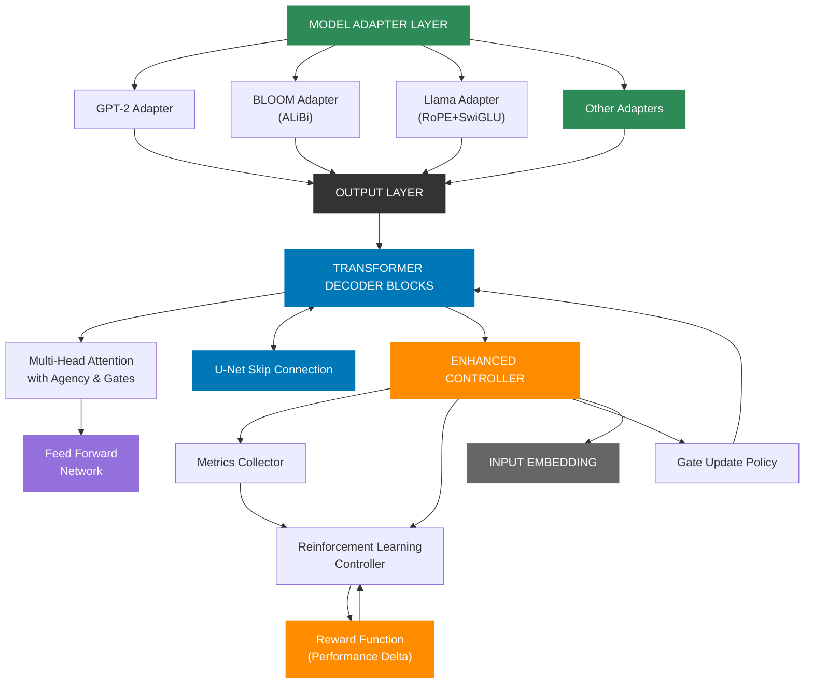

# 👾 Sentinel-AI

**Sentinel-AI isn't just trained. It forgets. It adapts. It evolves.**  
Sentinel-AI is a biologically inspired transformer that dynamically rewires itself through neural plasticity. It prunes underused attention heads, regrows them based on task demands, and tracks entropy rhythms over time to guide its own architectural evolution.

Inspired by neuroscience, it integrates entropy tracking, memory consolidation, stress recovery, and reinforcement learning to emulate cortical adaptation. The result is a model that survives change—not just performs well on static benchmarks.

```
           ┌─────────────────────────────────┐
           │                                 │
           ▼                                 │
┌─────────────────────┐             ┌───────────────────┐
│      PRUNING        │             │     GROWING       │
│                     │             │                   │
│  Remove inefficient │             │   Add new heads   │
│   attention heads   │             │  where needed     │
│ based on entropy    │             │  with gradual     │
│  and utilization    │             │  integration      │
└─────────────────────┘             └───────────────────┘
           │                                 ▲
           ▼                                 │
┌─────────────────────┐             ┌───────────────────┐
│     MEASURING       │────────────▶│     LEARNING      │
│                     │             │                   │
│  Assess performance │             │ Adapt remaining   │
│  of pruned model    │             │ and new heads     │
│  and identify gaps  │             │ with specialized  │
│                     │             │ learning rates    │
└─────────────────────┘             └───────────────────┘
```

## 🧠 Making Transformers More Like Human Brains

Sentinel-AI doesn't just mimic *machine learning* — it draws deeply from neuroscience to mimic *learning itself*. Each component of the system is inspired by biological mechanisms:

- **Neurons With Agency**:  
  Just like biological neurons signal fatigue or specialize, Sentinel-AI's attention heads can express *withdrawal, overload, misalignment,* or *activation* states. This isn't just gating — it's a communication system within the model, much like inter-neuronal signaling.

- **Plasticity Cycles Inspired by Sleep and Defragmentation**:  
  We modeled a *sleep-like defrag* phase, where the model stops acquiring new data and instead reorganizes its structure. This mirrors how sleep consolidates memory and reorganizes neural connections — making room for growth, pruning noise, and optimizing layout.

- **Entropy-Guided Pruning**:  
  Like synaptic pruning in human development, Sentinel-AI continuously removes low-information heads and pathways. The use of entropy isn't just a heuristic — it's a stand-in for metabolic cost and information utility.

- **Regrowth Through Cortical-Like Rewiring**:  
  Heads grow back based on performance gaps and attention entropy, with gradual ramp-up and mentorship from skip-connected pathways. This mirrors how neurons regrow and integrate during recovery, guided by cortical feedback and task-based utility.

- **Resilience to Damage**:  
  Even after major architectural changes (like 50% pruning), Sentinel-AI can recover its function — like brain regions compensating after injury, thanks to distributed computation and emergent specialization.

These principles aren't decorative. They allow us to **scale models down without degrading**, **recover faster**, and **build a more ethical, explainable AI system** that exhibits natural learning cycles. Sentinel-AI *forgets*, *remembers*, *gets tired*, *recovers*, and *improves over time* — just like you do.


## 💡 Key Features

- **🧠 Neural Plasticity Engine:**  
  Dynamically prunes and regrows attention heads based on entropy, usage, and resilience metrics—simulating synaptic remodeling.

- **🧪 Functional Preservation Tests:**  
  Measures whether core reasoning circuits are preserved across pruning events via controlled experiments and stress tasks.

- **⚙️ Stress Testing Suite:**  
  Alternates between memory, conflict, and diverse tasks to simulate cognitive strain and measure adaptive recovery.

- **🎯 RL-Controlled Architecture:**  
  Reinforcement learning agent governs architectural changes based on long-term survival metrics, not just loss minimization.

- **🛰️ Agency-Aware Attention:**  
  Each head signals its own readiness, fatigue, or withdrawal—mirroring emergent metacognitive control.

## 📊 Recent Milestones

- ✅ **Perplexity dropped from 975 → 211** after 500 adaptive steps on real-world Gutenberg samples.
- ✅ **Adaptive regrowth** restored model performance across entropy/magnitude/random pruning at 10–50%.
- ✅ **Stress protocols** now simulate memory loss, interference, and fatigue, with metrics for recovery and robustness.
- ✅ **Emergent behaviors** include self-withdrawal, regrowth in novel task-specific locations, and RL-learned plasticity rhythms.

## 🧬 Neuroscience Parallels

- **Synaptic pruning and regrowth:** Just as the brain prunes unnecessary connections during development and forms new ones during learning, Sentinel-AI continuously reshapes its attention architecture.
- **Plasticity-stability tradeoff:** Balances the need to adapt to new information (plasticity) with the need to preserve existing knowledge (stability).
- **Functional resilience after trauma:** Shows remarkable ability to recover function after substantial pruning or damage to its attention pathways.
- **Localized attention fatigue and recovery:** Individual attention heads can signal fatigue and temporarily withdraw from computation, similar to neural fatigue in biological systems.

## 🔄 The Neural Plasticity Cycle

Sentinel-AI implements a complete neural plasticity cycle that enables transformers to evolve their architecture intelligently:

1. **PRUNING** — Remove underutilized or inefficient attention heads using entropy-based metrics
2. **MEASURING** — Quantify the impact on performance and identify specific capability gaps
3. **GROWING** — Strategically add new heads where they're most needed with gradual integration
4. **LEARNING** — Apply specialized learning rates to new heads while fine-tuning the entire model

## Quickstart

```bash
# Install dependencies
pip install -r requirements.txt

# Run baseline generation
python main.py

# Optimize adaptive model
python scripts/optimize_model_plasticity.py \
  --model_name distilgpt2 \
  --dataset tiny_shakespeare \
  --optimization_targets perf,efficiency,size \
  --save_model --save_visualizations \
  --track_head_importance \
  --memory_based_training \
  --adaptive_pruning \
  --adaptive_growth \
  --dynamic_targets
```

**Preliminary results (CPU, 10 min, tiny_shakespeare):**
- Perplexity: **reduced significantly** through head pruning and regrowth
- Head Count: **reduced by up to ~30%** while improving or maintaining performance
- Efficiency: **improved (perplexity/head)** even on commodity hardware

*Note: These results are based on small-scale runs and may vary by dataset and system. We encourage replication and open benchmarking.*

This complete cycle is fully implemented with multiple strategies for each phase:
- **Pruning Strategies**: Entropy-based, Magnitude-based, Random baseline
- **Growth Strategies**: Gradient Sensitivity, Entropy Gap, Balanced Distribution, Random baseline
- **Integration Techniques**: Gradual warmup, U-Net skip connections, Differential learning rates

This cycle enables models to:
- Start small and become more efficient (30-70% fewer parameters)
- Grow intelligently in response to task complexity
- Maintain or improve performance despite significant pruning
- Continuously adapt to new data and tasks

The architecture introduces:

- **Attention Head Agency** – Internal state signaling allowing heads to express "overloaded," "misaligned," or "withdrawn" states
- **Sentinel Gating** – Learnable gating per attention head enabling pruning and selective reactivation
- **RL-based Controller** – Reinforcement learning controller that dynamically adapts architecture based on performance feedback
- **Hybrid Adapters** – Specialized adapters that preserve model-specific mechanisms (ALiBi, RoPE, SwiGLU) while enabling adaptivity
- **U-Net Inspired Regrowth** – Skip pathways and memory for reactivating previously pruned units without starting from scratch  
- **Multi-Model Support** – Compatible with diverse model families including GPT-2, BLOOM, Llama, and Pythia

> This system evolves from compact models into large, expressive ones by **dynamically growing** its structure in response to data complexity, while respecting the **agency** and **consent** of its components. This makes it ideal for ethical AI applications, edge devices, progressive scaling, and long-term continual learning.

## New: Neural Plasticity Module

We've added a new modular implementation of neural plasticity that makes it easier to apply these techniques to any transformer model:

```python
from utils.neural_plasticity.core import calculate_head_gradients, generate_pruning_mask, apply_pruning_mask
from utils.neural_plasticity.training import run_plasticity_loop
from utils.neural_plasticity.visualization import visualize_head_gradients, visualize_training_metrics

# Load model and data
model = AutoModelForCausalLM.from_pretrained("distilgpt2").to(device)
train_dataloader, eval_dataloader = get_dataloaders()

# Run complete neural plasticity loop
results = run_plasticity_loop(
    model=model,
    train_dataloader=train_dataloader,
    eval_dataloader=eval_dataloader,
    pruning_level=0.2,
    strategy="gradient",
    learning_rate=5e-5,
    training_steps=500
)

# Visualize results
visualize_head_gradients(
    results["grad_norm_values"],
    pruned_heads=results["pruned_heads"],
    title="Head Gradient Norms with Pruned Heads"
)
```

The neural plasticity module provides:

- Core algorithms for measuring head importance and applying pruning
- Visualization utilities for monitoring plasticity dynamics
- Training loops with differential learning rates for pruned models
- Comprehensive documentation and examples

See the [utils/neural_plasticity/README.md](utils/neural_plasticity/README.md) for more details, or try the [examples/neural_plasticity_example.py](examples/neural_plasticity_example.py) script to get started.

## 👾 System Architecture Overview



**Figure 1: Sentinel-AI Architecture Overview**. This diagram illustrates the complete architecture of Sentinel-AI, highlighting its key innovations. At the top, the Model Adapter Layer enables compatibility across diverse transformer architectures (GPT-2, BLOOM, Llama) while preserving their specialized mechanisms. The central Transformer Decoder Blocks feature attention heads with agency capabilities and gating mechanisms. The U-Net Skip Connections (inspired by computer vision) provide knowledge transfer between early and late layers, facilitating more effective pruning and regrowth by preserving essential patterns. At the heart of the system, the Enhanced Controller uses reinforcement learning to dynamically adjust the architecture based on performance metrics, implementing a feedback loop that allows the model to grow or prune itself as needed for maximum efficiency.

## 🌱 Head Growth

After pruning, Sentinel-AI can strategically regrow heads where they're most needed:

```python
def grow_attention_heads_gradually(pruning_module, growth_percentage=0.05, strategy="gradient_sensitivity", 
                                 initial_scale=0.01, warmup_steps=100):
    """
    Gradually grow new attention heads to prevent performance collapse.
    
    Args:
        pruning_module: The pruning module containing the model
        growth_percentage: Percentage of new heads to add
        strategy: Strategy to determine where to add heads
        initial_scale: Initial scaling factor for new head weights (small to start)
        warmup_steps: Number of steps to linearly increase head influence
        
    Returns:
        new_params: Model parameters with new heads added
        added_count: Number of heads added
        added_heads: List of (layer, head) tuples where heads were added
        warmup_schedule: Function to update head scaling during warmup
    """
```

Head growth is implemented with several key features:

1. **Gradual Integration** — New heads start with minimal influence and gradually increase
2. **Strategic Placement** — Heads are added where they'll have the most impact based on gradient sensitivity
3. **Knowledge Transfer** — U-Net skip connections help new heads learn from related patterns
4. **Specialized Learning** — New heads receive higher learning rates during initial training

## 👁️ Attention Head Evolution

```
┌───────────────────┐     ┌───────────────────┐     ┌───────────────────┐
│  INITIAL MODEL    │     │  AFTER PRUNING    │     │  AFTER GROWTH     │
│                   │     │                   │     │                   │
│  Layer 0:         │     │  Layer 0:         │     │  Layer 0:         │
│  ■ ■ ■ ■ ■ ■      │     │  ■ ■ □ ■ ■ ■      │     │  ■ ■ □ ■ ■ ■ ▣    │
│                   │     │                   │     │                   │
│  Layer 1:         │     │  Layer 1:         │     │  Layer 1:         │
│  ■ ■ ■ ■ ■ ■      │─────▶  ■ □ ■ □ ■ ■      │─────▶  ■ □ ■ □ ■ ■ ▣ ▣  │
│                   │     │                   │     │                   │
│  Layer 2:         │     │  Layer 2:         │     │  Layer 2:         │
│  ■ ■ ■ ■ ■ ■      │     │  ■ ■ ■ ■ □ □      │     │  ■ ■ ■ ■ □ □      │
│                   │     │                   │     │                   │
└───────────────────┘     └───────────────────┘     └───────────────────┘
                                                          LEGEND:
                                                          ■ Original head
                                                          □ Pruned head
                                                          ▣ New grown head
```

For more details and examples, refer to:

- [Neural Plasticity Example](examples/neural_plasticity_example.py)
- [Neural Plasticity Demonstration Notebook](colab_notebooks/NeuralPlasticityDemo.ipynb)
- [Neural Plasticity Module Documentation](utils/neural_plasticity/README.md)

---

[](./LICENSE)
[](./notebooks/)