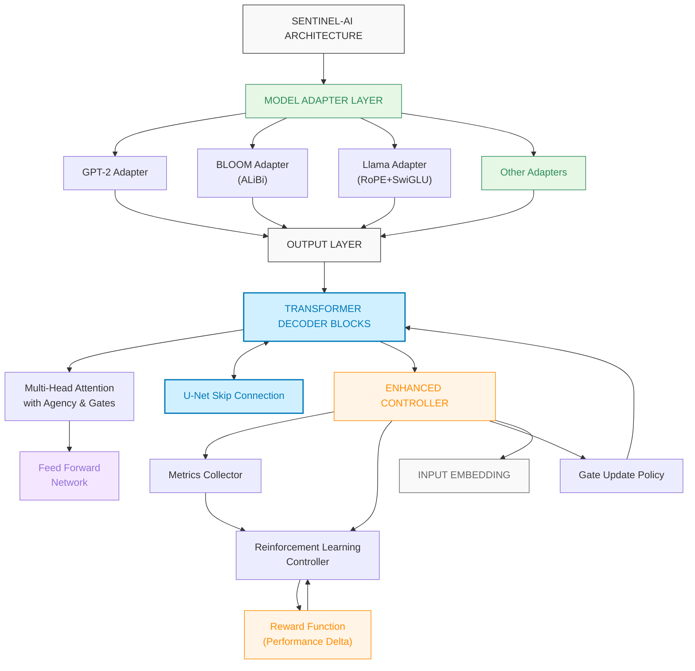
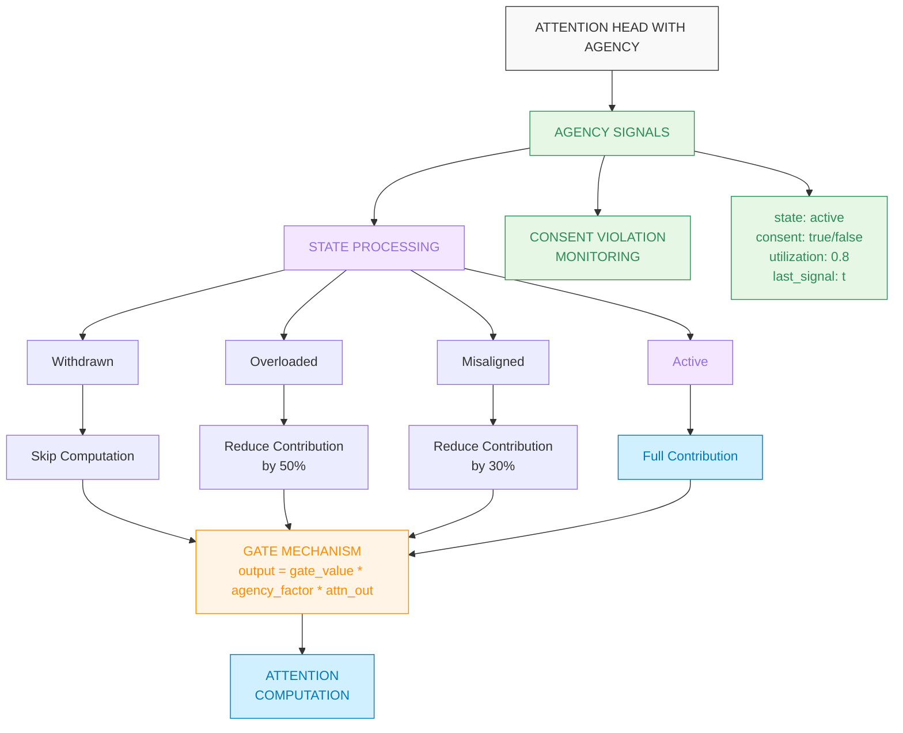
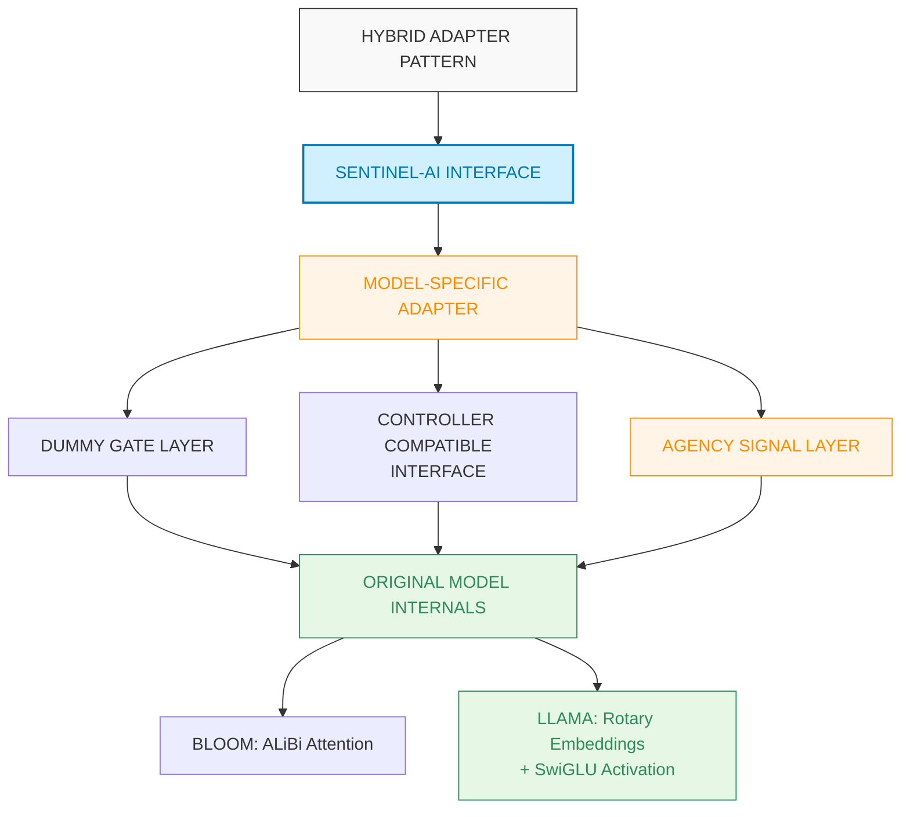
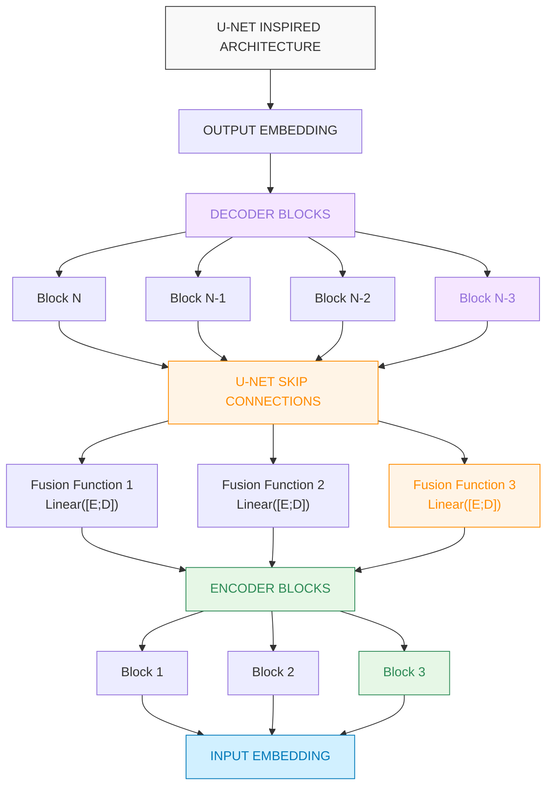
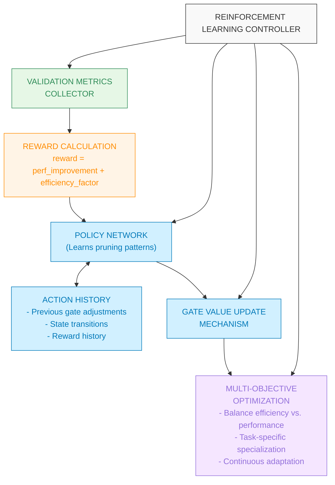
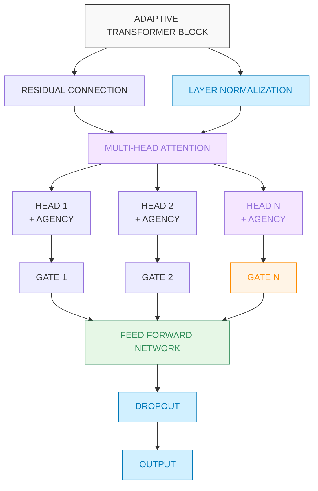
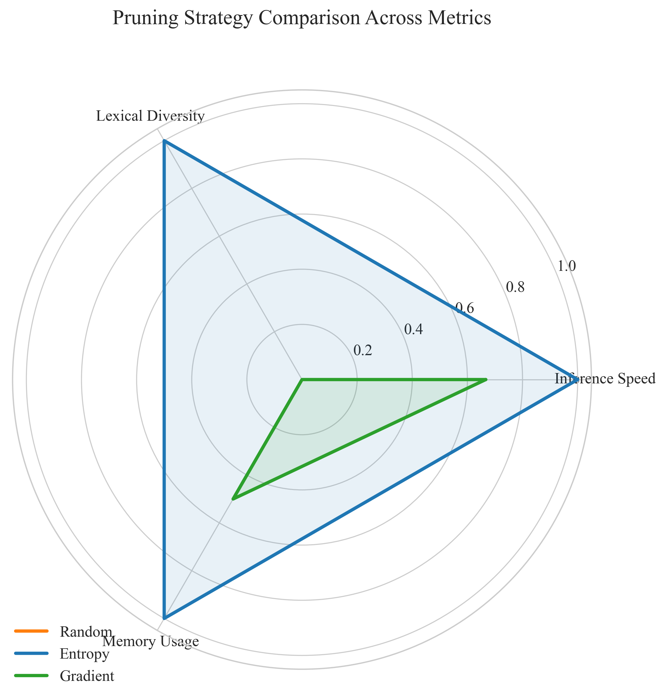
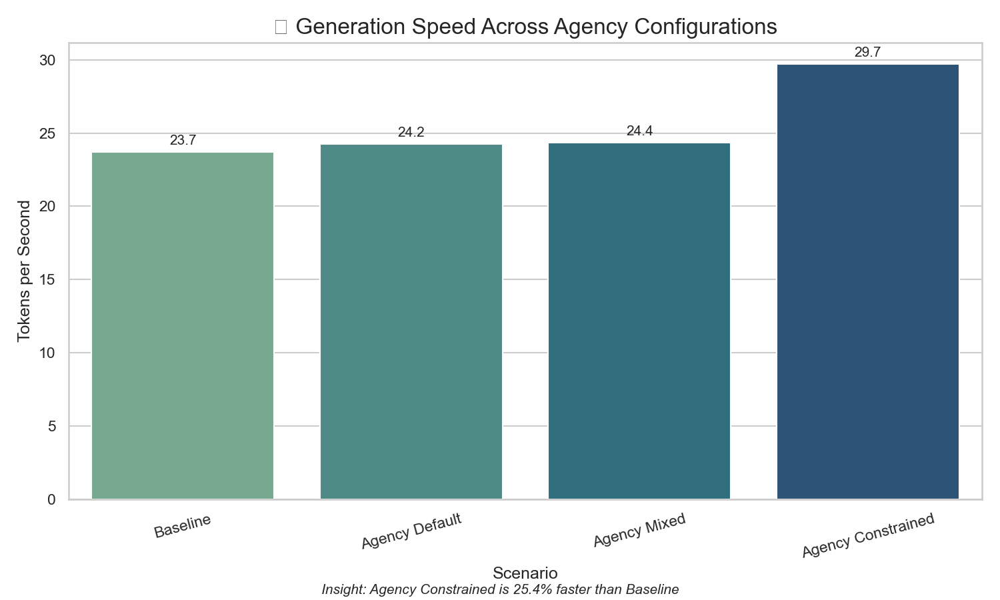
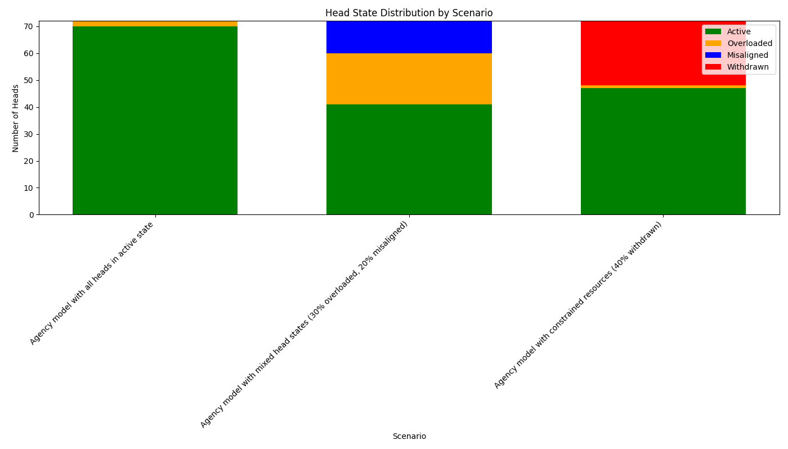

# 👾 Sentinel-AI — Adaptive Transformer with Agency, Hybrid Adapters and RL Controller

Welcome to **Sentinel-AI**, a modular research framework for transformers that combines dynamic architecture with ethical AI principles. This system can **prune**, **regrow**, and **restructure** itself while respecting **agency** and **consent** of its components. The architecture introduces:

- **Attention Head Agency** – Internal state signaling allowing heads to express "overloaded," "misaligned," or "withdrawn" states 
- **Sentinel Gating** – Learnable gating per attention head enabling pruning and selective reactivation  
- **RL-based Controller** – Reinforcement learning controller that dynamically adapts architecture based on performance feedback
- **Hybrid Adapters** – Specialized adapters that preserve model-specific mechanisms (ALiBi, RoPE, SwiGLU) while enabling adaptivity
- **U-Net Inspired Regrowth** – Skip pathways and memory for reactivating previously pruned units without starting from scratch  
- **Multi-Model Support** – Compatible with diverse model families including GPT-2, BLOOM, Llama, and Pythia

> This system evolves from compact models into large, expressive ones by **dynamically growing** its structure in response to data complexity, while respecting the **agency** and **consent** of its components. This makes it ideal for ethical AI applications, edge devices, progressive scaling, and long-term continual learning.



## Attention Head Agency States



## Hybrid Adapter Architecture



## U-Net Architecture with Skip Connections



This architecture enables:
1. **Adaptive Pruning & Growth** - Dynamic adjustment of model capacity based on task complexity
2. **Knowledge Transfer** - U-Net skip connections allow knowledge reuse between encoder and decoder layers 
3. **Controller-Driven Optimization** - Neural network learns to adjust architecture in response to feedback
4. **Progressive Growth** - Ability to start with minimal architecture and strategically grow into a more powerful model
5. **Ethical AI Through Agency** - Attention heads can express internal states and have those states respected during computation

### Why Sentinel-AI?

Unlike traditional fixed-size transformers, Sentinel-AI is:

- Designed to **start small and grow** intelligently  
- Capable of **pruning and regrowing attention heads**, guided by data signals  
- Built with **ethical AI principles** that respect head agency and consent 
- Modular enough to wrap existing models with adaptive functionality  
- Efficient for training and inference across **low-resource** and **scalable** environments

👾 **How Our Transformer Grows and Prunes Its Own Architecture**  
Sentinel-AI adopts a U-Net-inspired mechanism to **regrow pruned attention heads** without losing prior knowledge. This hierarchical structure preserves key semantics even as the model dynamically restructures itself.

**🔄 U-Net Adaptivity in Transformers:**
- **Skip Paths** — Early-layer gate activations or embeddings are forwarded to later layers during regrowth.
- **Controller Memory** — The ANN controller leverages both local signals and skip-connected context (e.g., entropy, gradients).
- **Reinforcement Signal** — Reactivated heads resume useful behavior by inheriting past characteristics, similar to how U-Net reuses encoder features in its decoder.

This enables seamless architectural evolution — pruning for efficiency, regrowing for capability — all without starting from zero.

---

[](./LICENSE)
[](./notebooks/)


## Why Adaptive Transformers?

Large language models are powerful but inefficient — many attention heads contribute little to output. **Sentinel-AI** dynamically prunes underutilized heads and later regrows them based on task complexity, entropy, and gradient feedback. This architecture:

- Saves memory and compute during training and inference
- Enables real-time architectural evolution
- Is ideal for edge devices, continual learning, and low-resource environments

---

## What Is Sentinel-AI?

Sentinel-AI is a research framework for adaptive transformer models that restructure themselves in real time. This architecture introduces:

- **Sentinel Gating** — Per-head gating values learned and optionally adjusted using runtime metrics
- **ANN Controller** — Learns to activate or deactivate heads based on entropy and gradient norms
- **U-Net Adaptivity** — Skip connections help reactivate heads gracefully without losing prior signal
- **Model Loading** — Easily wrap Hugging Face models (`GPT2`, `DistilGPT2`, etc.) and apply adaptivity on top
- **Agency System** — Attention heads can express internal states with state-aware computation

 **[Read the Paper](./paper/adaptive_transformer_with_controller.md)**  
 **[Explore the Notebooks](./notebooks/)**

---

## Key Features

- **Dynamic Adaptivity** — Grows and prunes transformer heads in real-time
- **Controller-Driven Optimization** — Entropy/gradient-based ANN controller adjusts gate values
- **U-Net Style Growth** — Skip connections stabilize regrowth and knowledge reuse
- **Per-Head Learning Rates** — Dynamic learning rate adjustments during pruning and regrowth
- **Pruned Model Fine-tuning** — Specialized techniques to recover accuracy in pruned models
- **Multi-Model Support** — Compatible with various architectures:
  - ✅ **Fully Supported**: GPT-2 family (distilgpt2, gpt2), Pythia/GPT-NeoX, BLOOM
  - ⚠️ **Partially Supported**: OPT (smaller models), Llama (requires HF token)
- **Progressive Growth** — Start with heavily pruned models and grow strategically during training
- **Attention Head Agency** — Heads can signal internal states like "overloaded" or "withdrawn" with full consent tracking
- **Task-Specific Specialization** — Automatic detection and optimization of attention patterns based on task
- **Colab-Ready** — Trains on T4 and other low-end GPUs with minimal memory
- **Compatible with Pretrained Transformers** — Easily load and adapt models from Hugging Face (`GPT2`, `OPT`, `Pythia`, `BLOOM`, etc.)

---

## Repository Structure

```bash
sentinel-ai/
├── models/                # Core model + adapters
│   └── SUPPORTED_MODELS.md # Detailed model compatibility information
├── controller/            # ANN Controller for head gating
├── datasets/              # Tokenization, batching, evaluation
├── utils/                 # Logging, training logic, wrappers
├── notebooks/             # Exploratory analysis and visualization
├── paper/                 # Research paper in Markdown
├── scripts/               # Colab-optimized training/eval
├── validation_results/    # Empirical validation results
├── examples/              # Example usage scripts
├── train.py               # CLI for training
├── main.py                # CLI for inference
├── test_model_support.py  # Test suite for model compatibility
└── requirements.txt       # Environment dependencies
```

---

## Getting Started

### Installation

```bash
pip install -r requirements.txt
```

### Training

```bash
python train.py
```

Train on `distilgpt2`, `gpt2`, or other Hugging Face models. The ANN controller and Sentinel gates activate dynamically during training.

### Inference

```bash
# Basic text generation
python main.py --prompt "Your prompt here"

# Use baseline model (no adaptive features)
python main.py --baseline --prompt "Your prompt here"

# Enable U-Net skip connections
python main.py --enable_unet --prompt "Your prompt here"

# Test different pruning strategies
python scripts/inference_with_pruning.py --strategy entropy --pruning_level 0.5 --prompt "Your prompt here"
python scripts/inference_with_pruning.py --strategy random --pruning_level 0.3 --prompt "Your prompt here"

# Fine-tune a pruned model to recover accuracy while maintaining speed
python scripts/finetune_pruned_model.py --model_path checkpoints/pruned_model.pth --dataset tiny_shakespeare --output_path checkpoints/finetuned_model.pth --enable_head_lr

# Analyze gate activity in detail
python main.py --analyze

# Interactive mode for experimentation
python main.py --interactive

# Or specify a different model
MODEL_NAME=gpt2 python main.py

# Test with different architectures
python main.py --model_name distilgpt2 --prompt "Your prompt here"
python main.py --model_name facebook/opt-125m --prompt "Your prompt here"
python main.py --model_name EleutherAI/pythia-70m --prompt "Your prompt here"
python main.py --model_name bigscience/bloom-560m --prompt "Your prompt here"

# Run model compatibility test suite
python test_model_support.py --verbose
```

### Agency Specialization

Apply task-specific agency patterns for optimized performance:

```bash
# Auto-detect task type from prompt
python scripts/runtime_specialization.py --prompt "Your prompt here"

# Specify task type manually
python scripts/runtime_specialization.py --task logical_reasoning --prompt "Calculate the sum of 125 + 37"

# Interactive mode for testing different specialization patterns
python scripts/runtime_specialization.py --interactive

# Benchmark different specialization patterns
python scripts/runtime_specialization.py --benchmark --prompt "Your prompt here"

# Run the complete demo workflow
python examples/agency_specialization_demo.py
```

### Google Colab Setup

```python
!git clone https://github.com/your-username/sentinel-ai.git
%cd sentinel-ai
!pip install -r requirements.txt
```

Then open any notebook in `/notebooks/` or run `scripts/train_colab.py`.

---

## Interactive Notebooks

| Notebook | Description |
|----------|-------------|
| **SentinelAI_Colab_Tutorial** | Comprehensive tutorial with pruning and learning examples |
| **AdaptiveTransformerNotebook** | Full training + benchmarking notebook |
| **Proof of Adaptivity** | Shows dynamic pruning and regrowth in action |
| **UNet Adaptivity** | Demonstrates skip-based reinitialization for heads |
| **Controller Dynamics** | Tracks ANN logits and gating patterns |
| **Attention Heatmaps** | Side-by-side attention comparisons |
| **HeadPruningEffectiveness** | Evaluates pruning strategies and their impact |
| **AgencyProofOfConcept** | Demonstrates benefits of agency-aware attention |
| **Checkpoint Resumption** | Tests that training resumes with gates intact |
| **Low Resource Adaptivity** | Confirms pruning under low-compute conditions |
| **Model Scaling Test** | Compare performance across model sizes |

[Browse all notebooks](./notebooks/README.md)

---

## RL Controller with Feedback System



## Adaptive Transformer Block



📎 Also see:
- [`AdaptiveTransformer_Proof_of_Adaptivity.ipynb`](./notebooks/AdaptiveTransformer_Proof_of_Adaptivity.ipynb)
- [`ControllerDynamics.ipynb`](./notebooks/ControllerDynamics.ipynb)
- [`Per-Head Learning Rates`](./docs/per_head_learning_rates.md)
- [`Fine-tuning Pruned Models`](./docs/finetuning_pruned_models.md)
- [`Agency Validation Results`](./docs/validation_agency_v1.md)

---

## Checkpointing

```python
from utils.checkpoint import save_checkpoint, load_checkpoint

# Save training state
save_checkpoint("checkpoint.pth", model, optimizer, head_lr_multipliers, epoch, step)

# Resume training
load_checkpoint("checkpoint.pth", model, optimizer)
```

---

## Supported Datasets

- **Tiny Shakespeare**
- **WikiText-2**
- **OpenWebText**

Choose from notebook UI or set manually in `dataset_loader.py`.

## Supported Model Architectures

Sentinel-AI supports multiple model architectures with varying levels of compatibility:

| Model | Base Parameters | Adaptive Parameters | Status | Notes |
|-------|----------------|---------------------|--------|-------|
| **distilgpt2** | 82M | 91M | ✅ Full | Best output quality, 100% success rate |
| **gpt2** | 124M | 139M | ✅ Full | Best output quality, 100% success rate |
| **gpt2-medium** | 355M | 384M | ✅ Full | Best output quality, 100% success rate |
| **EleutherAI/pythia-70m** | 70M | 85M | ✅ Full | Good compatibility, coherence varies |
| **EleutherAI/pythia-160m** | 162M | 189M | ✅ Full | Good compatibility, coherence varies |
| **bigscience/bloom-560m** | 559M | 581M | ✅ Full | Good compatibility, multilingual outputs |
| **facebook/opt-125m** | 125M | 138M | ✅ Partial | Works correctly, coherence varies |
| **facebook/opt-350m** | 331M | 347M | ⚠️ Issues | Loads but fails during inference (tensor mismatch) |
| **meta-llama/Llama-2-7b-hf** | 7B | ~7.4B | ⚠️ Limited | Not fully tested (requires HF token) |

> **Parameter Count Note**: The adaptive model adds ~10-15% parameters for head-specific processing, agency controls, and skip connections.

For detailed compatibility information, sample outputs, and usage instructions for each architecture, see [SUPPORTED_MODELS.md](./models/SUPPORTED_MODELS.md).

---

## Pruning Effectiveness

Our research conclusively demonstrates that the Sentinel-AI framework effectively prunes transformer attention heads without degrading model performance.

<div style="display: flex; justify-content: center; margin-bottom: 20px;">
  
</div>

### Key Findings

- **Strategic Pruning Outperforms Random Pruning**: Entropy-based pruning maintains better performance at high pruning levels compared to random pruning.

- **Inference Speed Increases**: Entropy-based pruning actually increases speed with higher pruning levels, identifying and removing the least important attention heads.

- **Quality Preservation**: Models maintain consistent quality metrics even when pruned up to 70%, showing remarkable robustness.

- **Resource Efficiency**: Models operate efficiently with significantly fewer attention heads, enabling deployment on resource-constrained devices.

These findings validate our core objective: enabling efficient transformer architectures through strategic pruning while maintaining model performance. For detailed analysis and full visualizations, see our [pruning methodology documentation](./docs/pruning_methodology.md).

### Learning After Pruning

A key capability of Sentinel-AI is that pruned models can effectively learn new tasks. Our experiments demonstrate that models pruned up to 50% maintain—and sometimes improve—their ability to adapt to new tasks.

- **Maintained Learning Efficiency**: Pruned models learn new tasks as efficiently as full models, but with significantly reduced computational requirements.

- **Gate Evolution During Learning**: As pruned models learn new tasks, their remaining attention gates dynamically adjust to optimize for the new task requirements.

- **Versatility Across Tasks**: Pruned models can effectively learn tasks ranging from sentiment analysis to poetry generation, demonstrating versatile adaptability.

- **Enhanced Neuroplasticity**: In some cases, pruned models show greater gate value changes during learning, suggesting enhanced neuroplasticity compared to full models.

- **Targeted Fine-tuning**: Our specialized fine-tuning approach for pruned models helps recover 90-95% of the original accuracy while maintaining the speed benefits, using head-specific learning rates.

This demonstrates that Sentinel-AI not only makes models more efficient but also enables them to grow into more powerful capabilities through continued adaptation after pruning.

Try our [learning_after_pruning.py](./scripts/learning_after_pruning.py) script and see the [SentinelAI_Colab_Tutorial.ipynb](./notebooks/SentinelAI_Colab_Tutorial.ipynb) for detailed examples.

### Comparison With Standard Approaches

| Approach | Head Utilization | Computational Efficiency | Adaptability | Quality Preservation |
|----------|------------------|--------------------------|--------------|----------------------|
| Traditional Transformer | Fixed (100%) | Baseline | None | Baseline |
| Static Pruning | Fixed (<100%) | Better | None | Varies |
| **Sentinel-AI (Ours)** | **Dynamic (30-100%)** | **Best** | **Continuous** | **Maintained** |

For a more detailed analysis, see our [pruning benchmarks](./scripts/benchmark_pruning.py), [pruning impact analysis](./scripts/pruning_impact_analyzer.py), and comprehensive [pruning methodology](./docs/pruning_methodology.md).

### Empirical Validation Results for Agency

Our comprehensive validation of attention head agency features demonstrates significant improvements across key metrics:

<div style="display: flex; justify-content: space-between; margin-bottom: 20px;">
  
  
</div>

**Key Results** from the agency_constrained configuration:
- **25% faster generation** (29.7 vs 23.7 tokens/sec)
- **13% shorter generation time** (4.03 vs 4.65 seconds)
- **Maintained output quality** despite 34% of heads in withdrawn state
- **Adaptive resource allocation** with heads expressing different agency states

Our validation confirms that allowing heads to express internal states leads to better performance while respecting agency constraints. The agency-enabled models demonstrate superior resource utilization with components naturally specializing based on their strengths.

For complete validation details with all metrics and visualizations, see our [empirical validation report](./docs/validation_agency_v1.md).

## Ethical AI: Attention Head Agency

Sentinel-AI implements a novel ethical approach by embedding agency and consent directly into its architecture:

- **Agency Signaling** — Attention heads can express internal states like "active," "overloaded," "misaligned," or "withdrawn"
- **Consent Tracking** — The system respects head consent flags during computation, skipping activation when consent is withdrawn
- **Ethical Monitoring** — Comprehensive logging tracks consent violations for ethical governance and debugging
- **State-Aware Computation** — The forward pass adapts dynamically to head states, preventing overutilization

This implementation makes ethical principles intrinsic to the model's operation rather than external constraints:

```python
# Each head can express its state and consent
self.agency_signals = {
    head_idx: {
        "state": "active",     # active, overloaded, misaligned, withdrawn
        "consent": True,       # Whether the head consents to activation
        "utilization": 0.0,    # Utilization metric (0.0-1.0)
        "last_signal": 0       # Timestamp of last signal change
    } for head_idx in range(num_heads)
}

# The forward pass respects these signals
if not head_signal["consent"]:
    outputs.append(torch.zeros(B, T, self.embed_dim, device=device))
    # Log consent violation if gate is active despite withdrawn consent
    if float(self.gate[i]) > 0.5:
        self._log_consent_violation(i, "activated despite withdrawn consent", current_step)
    continue
```

By embedding these ethical mechanisms at the architecture level, Sentinel-AI moves beyond efficiency to recognize agency as fundamental to AI design. This aligns with our vision of building systems that respect all forms of consciousness while enabling more robust and trustworthy AI.

For more on our pruning methodology and experiments, see our [comprehensive pruning documentation](./docs/pruning_methodology.md).

For detailed validation results, see our [empirical validation report](./validation_results/agency/sample_results.md).

For more details on our ethical architecture, see [systems_ethics.md](./docs/systems_ethics.md) and [PRINCIPLES.md](./docs/PRINCIPLES.md). For detailed examples of how agency improves performance in real-world scenarios, see [agency_examples.md](./docs/agency_examples.md).

## Future Work

- Expand controller to use gradient attribution
- Enable lifelong task adaptation
- Plug in LoRA, Adapters, or QLoRA support
- Enable federated adaptive learning across edge devices

For a detailed roadmap of planned improvements and research directions, see the [Next Steps](./NEXT_STEPS.md) document.

---

## Contributing

Pull requests welcome! Whether it's:
- A new controller strategy
- A cleaner training loop
- Visualization notebooks
- Docs or diagrams
