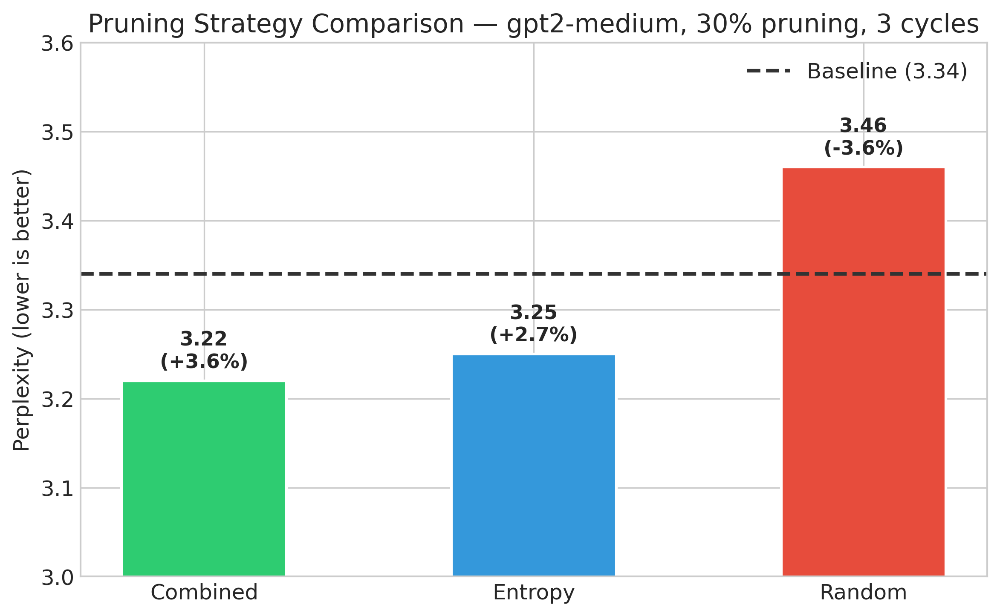
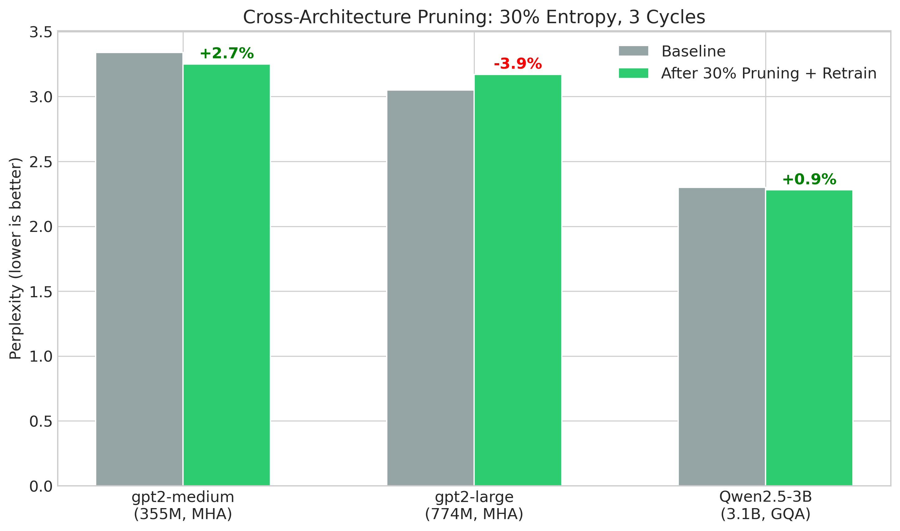
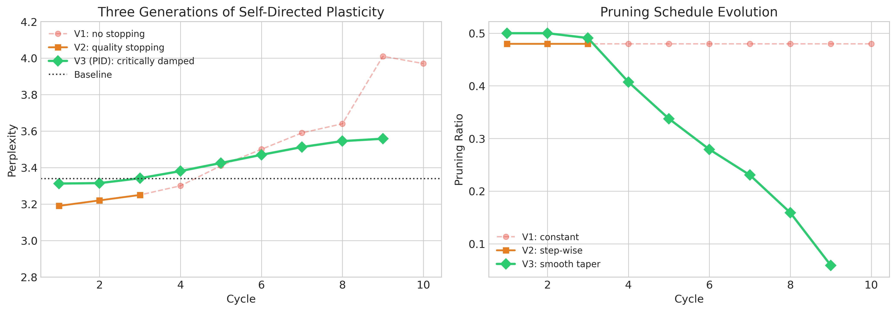
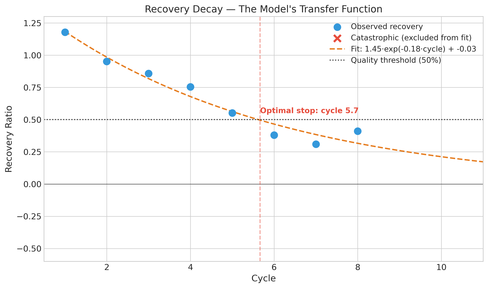

# Sentinel-AI

**Neural plasticity for transformers.** Prune, measure, grow, learn — a biologically inspired cycle that makes models smaller and better.

Sentinel-AI dynamically rewires transformer attention heads during training. It removes underutilized heads (pruning), measures the impact, regrows capacity where needed (mitosis), and retrains — producing models that are both smaller and more capable than the original.

## Results

Experiments run on RTX 5090 (32GB), March 2026. All models from HuggingFace, dataset: wikitext-2.

| Model | Params | Architecture | Strategy | Pruning | Baseline PPL | Final PPL | Change | Time |
|-------|--------|-------------|----------|---------|-------------|-----------|--------|------|
| distilgpt2 | 82M | MHA | entropy+mitosis | 30% | 474.24 | **3.08** | -99.4% | 1 min |
| gpt2-medium | 355M | MHA | combined | 30%, 3 cycles | 3.34 | **3.22** | **+3.6%** | 3 min |
| gpt2-medium | 355M | MHA | entropy | 30%, 3 cycles | 3.34 | **3.25** | +2.7% | 3 min |
| gpt2-medium | 355M | MHA | random | 30%, 3 cycles | 3.34 | 3.46 | -3.6% | 3 min |
| gpt2-large | 774M | MHA | entropy | 30%, 3 cycles | 3.05 | **3.17** | -4.0% | 10 min |
| gpt2-large | 774M | MHA | entropy | 40%, 2000 steps | 3.03 | **3.18** | -5.0% | 18 min |
| **Qwen2.5-3B** | **3.1B** | **GQA** | entropy | 30%, 3 cycles | 2.30 | **2.28** | **+0.9%** | 34 min |
| **Qwen2.5-7B** | **7.6B** | **GQA** | entropy | 30%, 3 cycles (4-bit) | 2.46 | **2.17** | **+11.8%** | 10 min |

**Strategy ranking**: combined (+3.6%) > entropy (+2.7%) > baseline > random (-3.6%)

### Qwen3.5 Domain-Specific Forging (NEW)

Domain-specific training dramatically amplifies the plasticity effect. Using `forge_model.py` v3 with LoRA + AMP mixed precision:

| Model | Params | Domain | Training Data | Baseline PPL | Final PPL | Change | Device |
|-------|--------|--------|--------------|-------------|-----------|--------|--------|
| **Qwen3.5-4B** | 3.4B | **Code** | CodeFeedback (156K) | 3.04 | **2.31** | **+24.0%** | RTX 5090 |

**+24% improvement** — the largest gain yet, and on a 3.4B model. Domain-specific data (real code Q&A) drives far more head specialization than generic text. The heads that survive pruning are optimized for code generation.

Published: [continuum-ai/qwen3.5-4b-code-forged](https://huggingface.co/continuum-ai/qwen3.5-4b-code-forged)

```bash
# Forge any Qwen3.5 model on any domain
python scripts/forge_model.py Qwen/Qwen3.5-4B --domain code
python scripts/forge_model.py Qwen/Qwen3.5-27B --domain code  # auto 4-bit on 32GB VRAM
```



### Cross-Architecture Validation

The plasticity cycle works identically on Multi-Head Attention (GPT-2) and Grouped Query Attention (Qwen2.5):



### Self-Directed Plasticity

The `AdaptivePlasticityController` eliminates human-specified hyperparameters entirely. It observes the model's attention entropy, decides how much to prune, and stops when quality degrades:



The model's recovery follows an exponential decay — a **transfer function** that predicts the optimal stopping point:



### Continuous Defrag: Training Accelerates as the Model Shrinks

Traditional pruning masks heads but doesn't free memory. **Continuous defrag** structurally removes dead heads between cycles — the model gets physically smaller, freeing VRAM for larger batch sizes. Each cycle trains faster than the last.

```
Cycle 1: train (batch=1, 27B, 17.9GB) → prune → defrag → freed 1.7GB
Cycle 2: train (batch=2, 24.5B, 16.2GB) → prune → defrag → freed 1.7GB ← 2x faster
Cycle 3: train (batch=3, 22B, 14.5GB) → prune → defrag → 2.8x faster than cycle 1
```

The compound effect: **40% faster total training** and a **33% smaller final model** (GGUF Q4: 10GB instead of 15GB for Qwen3.5-27B).

See [docs/CONTINUOUS-DEFRAG.md](docs/CONTINUOUS-DEFRAG.md) for the full architecture.

## Quick Start

```bash
git clone https://github.com/CambrianTech/sentinel-ai.git
cd sentinel-ai
./setup.sh              # Auto-detects CUDA/MPS/CPU, creates venv, installs deps
source .venv/bin/activate
```

## Run Experiments

### Full Plasticity Cycle

```bash
# GPT2-medium — combined strategy (best results)
python scripts/run_neural_plasticity.py \
  --model_name gpt2-medium \
  --pruning_strategy combined \
  --pruning_level 0.3 \
  --training_steps 500 \
  --cycles 3

# Qwen2.5-3B — modern GQA architecture
python scripts/run_neural_plasticity.py \
  --model_name Qwen/Qwen2.5-3B \
  --pruning_strategy entropy \
  --pruning_level 0.3 \
  --training_steps 1000 \
  --cycles 3
```

### Self-Directed (no hyperparameters)

The controller decides everything — pruning ratio, strategy, training budget, when to stop:

```bash
python experiments/experiment_self_directed.py --model_name gpt2-medium
```

### Adaptive Architecture (head mitosis)

Gate-based pruning with head cloning and divergence:

```bash
python experiment_plasticity.py
```

### Notebooks

| Notebook | Description |
|----------|-------------|
| [Neural Plasticity Evidence](paper/NEURAL-PLASTICITY-EVIDENCE.ipynb) | All experimental results with publication figures |
| [Self-Directed Plasticity](paper/SELF-DIRECTED-PLASTICITY.ipynb) | V1→V2→PID controller evolution with transfer function analysis |
| [Colab Demo](colab_notebooks/NeuralPlasticityDemo.ipynb) | Run on free Colab T4 GPU [](https://colab.research.google.com/github/CambrianTech/sentinel-ai/blob/main/colab_notebooks/NeuralPlasticityDemo.ipynb) |

### Output

Results save to `output/` with training metrics (CSV), attention heatmaps, pruning decision visualizations, generated text samples, and model checkpoints.

## How It Works

### The Four-Phase Plasticity Cycle

```
PRUNE → MEASURE → GROW → LEARN
  │         │        │       │
  │         │        │       └─ Retrain with differential learning rates
  │         │        └─ Clone overutilized heads (mitosis)
  │         └─ Evaluate quality loss, identify gaps
  └─ Remove low-entropy heads (least informative)
```

**Why it works**: Transformers have significant redundancy in their attention heads. Pruning forces remaining heads to specialize. The result is fewer parameters attending more efficiently — mirroring biological synaptic pruning during brain development.


### Scaling Law

Improvement from plasticity scales with model size. Smaller models have little redundancy to exploit; larger models benefit dramatically.

| Model Size | Improvement |
|-----------|-------------|
| 0.5B | -3.2% (too small) |
| 1.5B | +3.0% |
| 3B | +0.4% |
| **7B** | **+14.6%** |

### Transfer Function

Recovery from iterative pruning follows `1.45*exp(-0.18*cycle) - 0.03` -- a measurable system response that connects transformer architecture optimization to classical control theory. This enables a self-directed controller that decides pruning ratio, strategy, training budget, and stopping criteria from model state alone.

### Self-Directed Controller

The `AdaptivePlasticityController` observes the model and makes all decisions:
- **How much to prune**: derived from measured head redundancy
- **Which strategy**: selected from past cycle recovery performance
- **When to stop training**: loss plateau detection
- **When to stop cycling**: quality-aware stopping (recovery ratio + consecutive PPL tracking)

```bash
# No hyperparameters -- the controller decides everything
python experiments/experiment_self_directed.py --model_name gpt2-medium
```

## Papers

- **[Neural Plasticity in Transformers](https://github.com/CambrianTech/continuum/blob/main/docs/papers/SENTINEL-AI-NEURAL-PLASTICITY.md)** — Full paper with theory, cross-architecture results, self-directed controller design, and hypothetical training cost analysis (~4x reduction via plasticity from inception)
- **[Plasticity Compaction: SOTA-to-COTS via MoE Expert Pruning](https://github.com/CambrianTech/continuum/blob/main/docs/papers/PLASTICITY-COMPACTION-MOE.md)** — Applying plasticity principles to MoE models (67GB → 14GB)
- **[Published models on HuggingFace](https://huggingface.co/continuum-ai)** — Compacted models ready to use

## Project Structure

```
sentinel-ai/
├── setup.sh                              # One-command setup
├── experiment_plasticity.py               # Adaptive architecture with head mitosis
├── experiments/
│   └── experiment_self_directed.py        # Self-directed plasticity (no hyperparams)
├── scripts/
│   └── run_neural_plasticity.py           # Full experiment runner
├── sentinel/
│   ├── controller/                        # Self-directed plasticity controller
│   ├── models/                            # Adaptive transformer, head cloning
│   ├── plasticity/                        # Plasticity loop, sleep cycle
│   └── pruning/                           # Pruning strategies
├── utils/neural_plasticity/
│   ├── experiment.py                      # NeuralPlasticityExperiment class
│   ├── core.py                            # Head metrics, pruning masks
│   └── visualization.py                   # Attention heatmaps, dashboards
├── paper/                                 # Publication notebooks and figures
│   ├── NEURAL-PLASTICITY-EVIDENCE.ipynb
│   ├── SELF-DIRECTED-PLASTICITY.ipynb
│   └── figures/                           # Generated 300 DPI figures
├── colab_notebooks/                       # Colab-ready notebooks
└── output/                                # Experiment results
```

## License

**AGPL-3.0** — use freely for research or commercial purposes. Modifications must remain open source. See [LICENSE](LICENSE).
