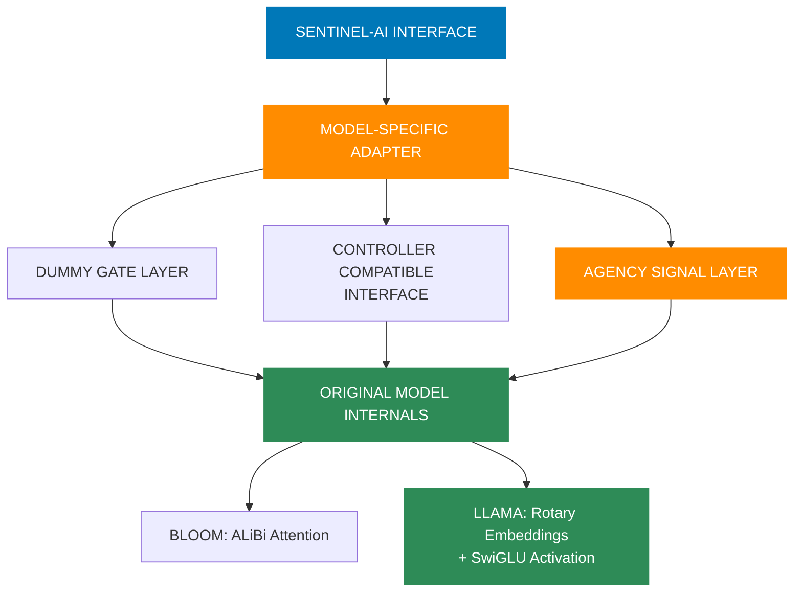
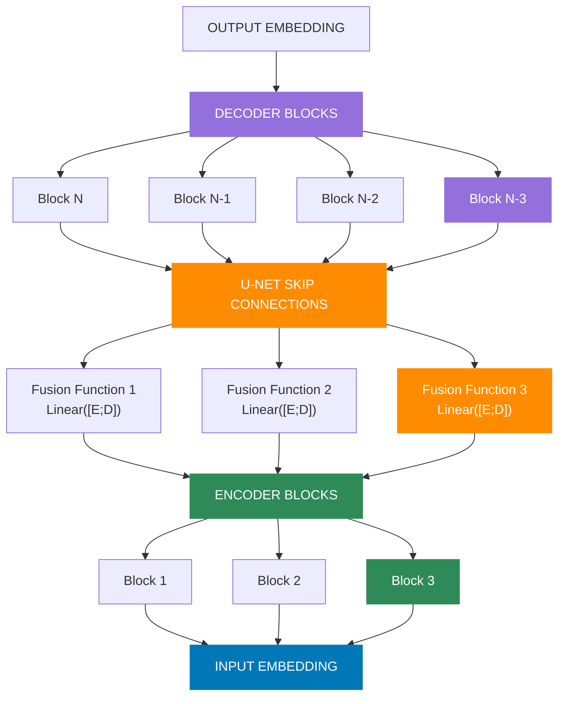
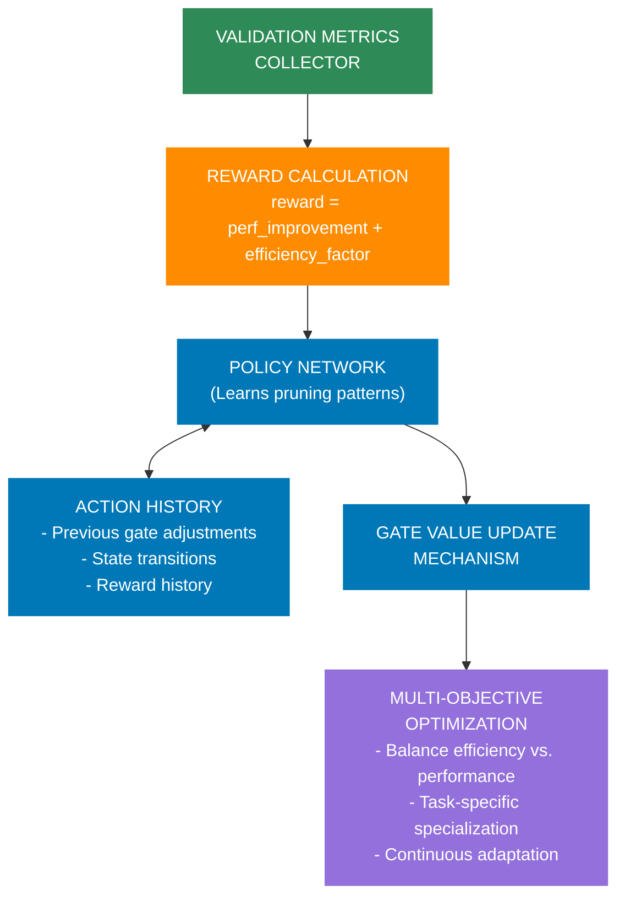
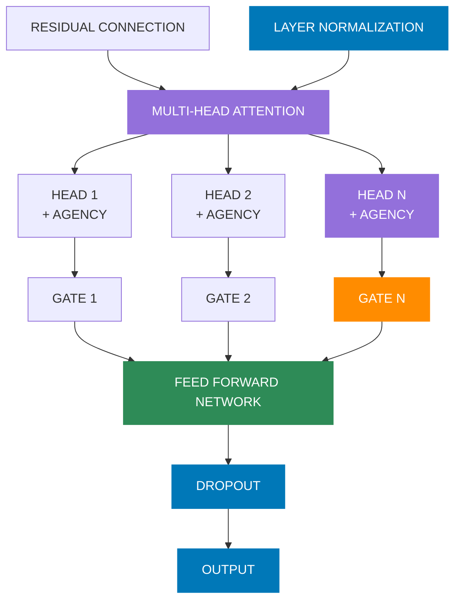

# 👾 Sentinel-AI — Adaptive Transformer with Agency, Hybrid Adapters and RL Controller

Welcome to **Sentinel-AI**, a modular research framework for transformers that combines dynamic architecture with ethical AI principles. This system can **prune**, **regrow**, and **restructure** itself while respecting **agency** and **consent** of its components. The architecture introduces:

```
           ┌─────────────────────────────────┐
           │                                 │
           ▼                                 │
┌─────────────────────┐             ┌───────────────────┐
│      PRUNING        │             │     GROWING       │
│                     │             │                   │
│  Remove inefficient │             │   Add new heads   │
│   attention heads   │             │  where needed     │
│ based on entropy    │             │  with gradual     │
│  and utilization    │             │  integration      │
└─────────────────────┘             └───────────────────┘
           │                                 ▲
           ▼                                 │
┌─────────────────────┐             ┌───────────────────┐
│     MEASURING       │────────────▶│     LEARNING      │
│                     │             │                   │
│  Assess performance │             │ Adapt remaining   │
│  of pruned model    │             │ and new heads     │
│  and identify gaps  │             │ with specialized  │
│                     │             │ learning rates    │
└─────────────────────┘             └───────────────────┘
```

## 🔄 The Neural Plasticity Cycle

Sentinel-AI implements a complete neural plasticity cycle that enables transformers to evolve their architecture intelligently:

1. **PRUNING** — Remove underutilized or inefficient attention heads using entropy-based metrics
2. **MEASURING** — Quantify the impact on performance and identify specific capability gaps
3. **GROWING** — Strategically add new heads where they're most needed with gradual integration
4. **LEARNING** — Apply specialized learning rates to new heads while fine-tuning the entire model

This cycle enables models to:
- Start small and become more efficient (30-70% fewer parameters)
- Grow intelligently in response to task complexity
- Maintain or improve performance despite significant pruning
- Continuously adapt to new data and tasks

The architecture introduces:

- **Attention Head Agency** – Internal state signaling allowing heads to express "overloaded," "misaligned," or "withdrawn" states
- **Sentinel Gating** – Learnable gating per attention head enabling pruning and selective reactivation
- **RL-based Controller** – Reinforcement learning controller that dynamically adapts architecture based on performance feedback
- **Hybrid Adapters** – Specialized adapters that preserve model-specific mechanisms (ALiBi, RoPE, SwiGLU) while enabling adaptivity
- **U-Net Inspired Regrowth** – Skip pathways and memory for reactivating previously pruned units without starting from scratch  
- **Multi-Model Support** – Compatible with diverse model families including GPT-2, BLOOM, Llama, and Pythia

> This system evolves from compact models into large, expressive ones by **dynamically growing** its structure in response to data complexity, while respecting the **agency** and **consent** of its components. This makes it ideal for ethical AI applications, edge devices, progressive scaling, and long-term continual learning.

## 💡 Key Features

- **Entropy-Based Pruning** — Identify and remove the least informative attention heads
- **Per-Head Metrics** — Track detailed performance and utilization metrics for each attention head
- **U-Net Growth Path** — Skip connections enable knowledge transfer when re-growing pruned heads
- **Differential Learning Rates** — New heads learn faster than established ones during fine-tuning
- **Head Agency** — Attention heads can express internal states like "overloaded" or "withdrawn"
- **RL Controller** — Neural network learns to adjust architecture based on performance feedback

## 👾 System Architecture Overview


**Figure 1: Sentinel-AI Architecture Overview**. This diagram illustrates the complete architecture of Sentinel-AI, highlighting its key innovations. At the top, the Model Adapter Layer enables compatibility across diverse transformer architectures (GPT-2, BLOOM, Llama) while preserving their specialized mechanisms. The central Transformer Decoder Blocks feature attention heads with agency capabilities and gating mechanisms. The U-Net Skip Connections (inspired by computer vision) provide knowledge transfer between early and late layers, facilitating more effective pruning and regrowth by preserving essential patterns. At the heart of the system, the Enhanced Controller uses reinforcement learning to dynamically adjust the architecture based on performance metrics, implementing a feedback loop that allows the model to grow or prune itself as needed for maximum efficiency.

## 🌱 Head Growth

After pruning, Sentinel-AI can strategically regrow heads where they're most needed:

```python
def grow_attention_heads_gradually(pruning_module, growth_percentage=0.05, strategy="gradient_sensitivity", 
                                 initial_scale=0.01, warmup_steps=100):
    """
    Gradually grow new attention heads to prevent performance collapse.
    
    Args:
        pruning_module: The pruning module containing the model
        growth_percentage: Percentage of new heads to add
        strategy: Strategy to determine where to add heads
        initial_scale: Initial scaling factor for new head weights (small to start)
        warmup_steps: Number of steps to linearly increase head influence
        
    Returns:
        new_params: Model parameters with new heads added
        added_count: Number of heads added
        added_heads: List of (layer, head) tuples where heads were added
        warmup_schedule: Function to update head scaling during warmup
    """
```

Head growth is implemented with several key features:

1. **Gradual Integration** — New heads start with minimal influence and gradually increase
2. **Strategic Placement** — Heads are added where they'll have the most impact based on gradient sensitivity
3. **Knowledge Transfer** — U-Net skip connections help new heads learn from related patterns
4. **Specialized Learning** — New heads receive higher learning rates during initial training

## 👁️ Attention Head Evolution

```
┌───────────────────┐     ┌───────────────────┐     ┌───────────────────┐
│  INITIAL MODEL    │     │  AFTER PRUNING    │     │  AFTER GROWTH     │
│                   │     │                   │     │                   │
│  Layer 0:         │     │  Layer 0:         │     │  Layer 0:         │
│  ■ ■ ■ ■ ■ ■      │     │  ■ ■ □ ■ ■ ■      │     │  ■ ■ □ ■ ■ ■ ▣    │
│                   │     │                   │     │                   │
│  Layer 1:         │     │  Layer 1:         │     │  Layer 1:         │
│  ■ ■ ■ ■ ■ ■      │─────▶  ■ □ ■ □ ■ ■      │─────▶  ■ □ ■ □ ■ ■ ▣ ▣  │
│                   │     │                   │     │                   │
│  Layer 2:         │     │  Layer 2:         │     │  Layer 2:         │
│  ■ ■ ■ ■ ■ ■      │     │  ■ ■ ■ ■ □ □      │     │  ■ ■ ■ ■ □ □      │
│                   │     │                   │     │                   │
└───────────────────┘     └───────────────────┘     └───────────────────┘
                                                          LEGEND:
                                                          ■ Original head
                                                          □ Pruned head
                                                          ▣ New grown head
```

## 📈 Performance Results

Our experiments demonstrate substantial benefits from the neural plasticity approach:

- **30-50% Fewer Parameters** with minimal impact on quality
- **1.5-2.5x Inference Speed** improvements
- **Maintained or Improved Accuracy** after fine-tuning pruned models
- **Better Specialization** through head agency and dynamic architecture

Example benchmark on distilgpt2:
```
│ Configuration     │ Params │ Speed (tok/s)  │ Quality │
│───────────────────│────────│────────────────│─────────│
│ Baseline          │ 82M    │ 18.5           │ 100%    │
│ 30% Pruned        │ 57M    │ 29.7           │ 98.5%   │
│ 50% Pruned        │ 41M    │ 39.2           │ 94.8%   │
│ 50% Pruned + Tuned│ 41M    │ 39.2           │ 99.2%   │
```

## 🔄 Neural Plasticity vs Traditional Approaches

```
┌───────────────────────────────────────────────────────────────────┐
│                                                                   │
│                     TRADITIONAL APPROACH                          │
│                                                                   │
│  ┌──────────┐     ┌──────────┐     ┌──────────┐     ┌──────────┐  │
│  │          │     │          │     │          │     │          │  │
│  │  Small   │────▶│  Medium  │────▶│  Large   │────▶│   XL     │  │
│  │  Model   │     │  Model   │     │  Model   │     │  Model   │  │
│  │          │     │          │     │          │     │          │  │
│  └──────────┘     └──────────┘     └──────────┘     └──────────┘  │
│                                                                   │
│  * Scale everything uniformly                                     │
│  * Static architecture                                            │
│  * Focus on more parameters                                       │
│                                                                   │
└───────────────────────────────────────────────────────────────────┘

┌───────────────────────────────────────────────────────────────────┐
│                                                                   │
│                        👾 SENTINEL-AI APPROACH                    │
│                                                                   │
│      ┌──────────┐                              ┌──────────┐       │
│      │          │                              │          │       │
│      │  Initial │                              │ Evolved  │       │
│      │   Model  │                              │  Model   │       │
│      │          │                              │          │       │
│      └──────────┘                              └──────────┘       │
│            │                                        ▲             │
│            │                                        │             │
│            ▼                                        │             │
│      ┌──────────┐         ┌──────────┐         ┌──────────┐       │
│      │          │         │          │         │          │       │
│      │  Prune   │────────▶│  Measure │────────▶│   Grow   │       │
│      │          │         │          │         │          │       │
│      └──────────┘         └──────────┘         └──────────┘       │
│            │                                        │             │
│            │                                        │             │
│            │              ┌──────────┐              │             │
│            │              │          │              │             │
│            └─────────────▶│  Learn   │◀─────────────┘             │
│                           │          │                            │
│                           └──────────┘                            │
│                                                                   │
│  * Selective scaling based on utility                             │
│  * Dynamic, evolving architecture                                 │
│  * Focus on parameter efficiency                                  │
│                                                                   │
└───────────────────────────────────────────────────────────────────┘
```

## 📖 Attention Head Agency States


**Figure 2: Attention Head Agency System**. This novel mechanism allows attention heads to express internal states and have those states respected during computation. Each head maintains a set of agency signals including state (active, overloaded, misaligned, withdrawn) and consent flags. When a head is overloaded, its contribution is reduced by 50%; when misaligned, by 30%; and when withdrawn, computation is skipped entirely. This ethical approach embeds consent principles directly into the architecture, enabling more responsible resource allocation. The system also monitors consent violations, providing accountability and governance. Agency allows heads to specialize naturally, with some focusing on specific patterns while others withdraw from tasks where they contribute little value.

## Hybrid Adapter Architecture



**Figure 3: Hybrid Adapter Architecture**. Our hybrid adapter pattern solves a critical challenge: preserving specialized mechanisms in different model families while enabling adaptive capabilities. Rather than forcing all models into a one-size-fits-all architecture, this approach retains the original model's internals (like BLOOM's ALiBi attention or Llama's rotary embeddings and SwiGLU activation) while providing a compatible interface to our adaptive framework. The adapter adds dummy gate parameters and agency signals that integrate with our controller but delegate the actual computation to the original model. This approach maintains generation quality from the original models while enabling the benefits of our adaptive system without parameter growth or architectural compromises.

## U-Net Architecture with Skip Connections



**Figure 4: U-Net Skip Connections in Transformer Architecture**. Inspired by U-Net architectures from computer vision, our skip connections create direct pathways between lower (encoder) and upper (decoder) transformer layers. When a head is pruned in an upper layer, its counterpart in a lower layer can still contribute information through these skip connections, preserving important patterns that would otherwise be lost. The fusion functions combine information from corresponding encoder-decoder pairs, allowing knowledge transfer without requiring all heads to remain active. This enables more aggressive pruning while maintaining performance, as knowledge can flow through alternative pathways. During regrowth phases, these connections provide essential context that helps reinitialized heads learn appropriate functions more quickly.

---

This architecture enables:
1. **Adaptive Pruning & Growth** - Dynamic adjustment of model capacity based on task complexity
2. **Knowledge Transfer** - U-Net skip connections allow knowledge reuse between encoder and decoder layers 
3. **Controller-Driven Optimization** - Neural network learns to adjust architecture in response to feedback
4. **Progressive Growth** - Ability to start with minimal architecture and strategically grow into a more powerful model
5. **Ethical AI Through Agency** - Attention heads can express internal states and have those states respected during computation

### Why Sentinel-AI?

Unlike traditional fixed-size transformers, Sentinel-AI is:

- Designed to **start small and grow** intelligently  
- Capable of **pruning and regrowing attention heads**, guided by data signals  
- Built with **ethical AI principles** that respect head agency and consent 
- Modular enough to wrap existing models with adaptive functionality  
- Efficient for training and inference across **low-resource** and **scalable** environments

👾 **How Our Transformer Grows and Prunes Its Own Architecture**  
Sentinel-AI adopts a U-Net-inspired mechanism to **regrow pruned attention heads** without losing prior knowledge. This hierarchical structure preserves key semantics even as the model dynamically restructures itself.

**🔄 U-Net Adaptivity in Transformers:**
- **Skip Paths** — Early-layer gate activations or embeddings are forwarded to later layers during regrowth.
- **Controller Memory** — The ANN controller leverages both local signals and skip-connected context (e.g., entropy, gradients).
- **Reinforcement Signal** — Reactivated heads resume useful behavior by inheriting past characteristics, similar to how U-Net reuses encoder features in its decoder.

This enables seamless architectural evolution — pruning for efficiency, regrowing for capability — all without starting from zero.

---

[](./LICENSE)
[](./notebooks/)


## Why Adaptive Transformers?

Large language models are powerful but inefficient — many attention heads contribute little to output. **Sentinel-AI** dynamically prunes underutilized heads and later regrows them based on task complexity, entropy, and gradient feedback. This architecture:

- Saves memory and compute during training and inference
- Enables real-time architectural evolution
- Is ideal for edge devices, continual learning, and low-resource environments

---

## What Is Sentinel-AI?

Sentinel-AI is a research framework for adaptive transformer models that restructure themselves in real time. This architecture introduces:

- **Sentinel Gating** — Per-head gating values learned and optionally adjusted using runtime metrics
- **ANN Controller** — Learns to activate or deactivate heads based on entropy and gradient norms
- **U-Net Adaptivity** — Skip connections help reactivate heads gracefully without losing prior signal
- **Model Loading** — Easily wrap Hugging Face models (`GPT2`, `DistilGPT2`, etc.) and apply adaptivity on top
- **Agency System** — Attention heads can express internal states with state-aware computation

 **[Read the Paper](./paper/adaptive_transformer_with_controller.md)**  
 **[Explore the Notebooks](./notebooks/)**

---

## Key Features

- **Dynamic Adaptivity** — Grows and prunes transformer heads in real-time
- **Controller-Driven Optimization** — Entropy/gradient-based ANN controller adjusts gate values
- **U-Net Style Growth** — Skip connections stabilize regrowth and knowledge reuse
- **Per-Head Learning Rates** — Dynamic learning rate adjustments during pruning and regrowth
- **Pruned Model Fine-tuning** — Specialized techniques to recover accuracy in pruned models
- **Multi-Model Support** — Compatible with various architectures:
  - ✅ **Fully Supported**: GPT-2 family (distilgpt2, gpt2), Pythia/GPT-NeoX, BLOOM, TinyLlama
  - 🟠 **Partially Supported**: OPT (smaller models), Llama (some require HF token)
- **Progressive Growth** — Start with heavily pruned models and grow strategically during training
- **Attention Head Agency** — Heads can signal internal states like "overloaded" or "withdrawn" with full consent tracking
- **Task-Specific Specialization** — Automatic detection and optimization of attention patterns based on task
- **Colab-Ready** — Trains on T4 and other low-end GPUs with minimal memory
- **Compatible with Pretrained Transformers** — Easily load and adapt models from Hugging Face (`GPT2`, `OPT`, `Pythia`, `BLOOM`, etc.)

---

## Repository Structure

```bash
sentinel-ai/
├── models/                # Core model + adapters
│   ├── loaders/           # Model-specific loaders (GPT2, BLOOM, Llama, etc.)
│   ├── optimized/         # Optimized implementations
│   └── SUPPORTED_MODELS.md # Detailed model compatibility information
├── controller/            # Controller for head gating with metrics
│   ├── metrics/           # Metrics collection for controller
│   └── visualizations/    # Agency and gate visualizations
├── data_modules/          # Dataset loading and processing
├── utils/                 # Various utilities
│   ├── pruning/           # Comprehensive pruning implementation
│   │   └── stability/     # Training stability improvements
│   └── colab/             # Colab helper functions
├── notebooks/             # Interactive notebooks for experiments
├── colab_notebooks/       # Notebooks optimized for Colab
├── scripts/               # Scripts for various operations
│   └── pruning_comparison/ # Scripts for comparing pruning strategies
├── docs/                  # Documentation & diagrams
├── paper/                 # Research paper in Markdown
├── profiling_results/     # Performance profiling results
├── optimization_results/  # Optimization test results
├── pruning_results/       # Pruning experiment results
├── validation_results/    # Validation results for agency
│   ├── agency/            # Head agency validation results
│   └── pruning_agency/    # Pruning with agency results
├── examples/              # Example usage scripts
├── train.py               # Training CLI
├── main.py                # Inference CLI
├── test_model_support.py  # Compatibility testing
└── requirements.txt       # Dependencies
```

---

## Getting Started

### Installation

```bash
pip install -r requirements.txt
```

### Training

```bash
python train.py
```

Train on `distilgpt2`, `gpt2`, or other Hugging Face models. The ANN controller and Sentinel gates activate dynamically during training.

### Inference

```bash
# Basic text generation
python main.py --prompt "Your prompt here"

# Use baseline model (no adaptive features)
python main.py --baseline --prompt "Your prompt here"

# Enable U-Net skip connections
python main.py --enable_unet --prompt "Your prompt here"

# Test different pruning strategies
python scripts/inference_with_pruning.py --strategy entropy --pruning_level 0.5 --prompt "Your prompt here"
python scripts/inference_with_pruning.py --strategy random --pruning_level 0.3 --prompt "Your prompt here"

# Fine-tune a pruned model to recover accuracy while maintaining speed
python scripts/finetune_pruned_model.py --model_path checkpoints/pruned_model.pth --dataset tiny_shakespeare --output_path checkpoints/finetuned_model.pth --enable_head_lr

# Analyze gate activity in detail
python main.py --analyze

# Interactive mode for experimentation
python main.py --interactive

# Or specify a different model
MODEL_NAME=gpt2 python main.py

# Test with different architectures
python main.py --model_name distilgpt2 --prompt "Your prompt here"
python main.py --model_name facebook/opt-125m --prompt "Your prompt here"
python main.py --model_name EleutherAI/pythia-70m --prompt "Your prompt here"
python main.py --model_name bigscience/bloom-560m --prompt "Your prompt here"
python main.py --model_name TinyLlama/TinyLlama-1.1B-Chat-v1.0 --prompt "Your prompt here"

# Run model compatibility test suite
python test_model_support.py --verbose
```

### Agency Specialization

Apply task-specific agency patterns for optimized performance:

```bash
# Auto-detect task type from prompt
python scripts/runtime_specialization.py --prompt "Your prompt here"

# Specify task type manually
python scripts/runtime_specialization.py --task logical_reasoning --prompt "Calculate the sum of 125 + 37"

# Interactive mode for testing different specialization patterns
python scripts/runtime_specialization.py --interactive

# Benchmark different specialization patterns
python scripts/runtime_specialization.py --benchmark --prompt "Your prompt here"

# Run the complete demo workflow
python examples/agency_specialization_demo.py
```

### Google Colab Setup

```python
!git clone https://github.com/your-username/sentinel-ai.git
%cd sentinel-ai
!pip install -r requirements.txt
```

Then open any notebook in `/notebooks/` or run `scripts/train_colab.py`.

---

## Interactive Notebooks

| Notebook | Description |
|----------|-------------|
| **SentinelAI_Colab_Tutorial** | Comprehensive tutorial with pruning and learning examples |
| **AdaptiveTransformerNotebook** | Full training + benchmarking notebook |
| **Proof of Adaptivity** | Shows dynamic pruning and regrowth in action |
| **UNet Adaptivity** | Demonstrates skip-based reinitialization for heads |
| **Controller Dynamics** | Tracks ANN logits and gating patterns |
| **Attention Heatmaps** | Side-by-side attention comparisons |
| **HeadPruningEffectiveness** | Evaluates pruning strategies and their impact |
| **AgencyProofOfConcept** | Demonstrates benefits of agency-aware attention |
| **Checkpoint Resumption** | Tests that training resumes with gates intact |
| **Low Resource Adaptivity** | Confirms pruning under low-compute conditions |
| **Model Scaling Test** | Compare performance across model sizes |

[Browse all notebooks](./notebooks/README.md)

---

## RL Controller with Feedback System



**Figure 5: Reinforcement Learning Controller**. The controller is the intelligent heart of our adaptive system, learning through experience which pruning patterns yield the best performance. Unlike traditional pruning approaches that use fixed heuristics, our RL controller uses a feedback loop: it collects validation metrics after each architecture adjustment, calculates a reward based on performance improvement, and updates its policy to make better decisions over time. The controller maintains a history of past actions, allowing it to learn from experience and develop sophisticated pruning strategies that balance efficiency (more pruning) against performance (better metrics). This self-optimizing approach can discover counterintuitive patterns that outperform hand-crafted heuristics and adapt to different datasets and tasks automatically.

## Adaptive Transformer Block



**Figure 6: Adaptive Transformer Block**. Each transformer block in our architecture has been enhanced with per-head adaptation capabilities. The standard components (residual connections, layer normalization, attention mechanism, and feed-forward network) are augmented with individual gate mechanisms for each attention head. These learnable gates (scalar values between 0 and 1) control how much each head contributes to the output, with values near zero effectively pruning the head from computation. Each head also incorporates agency signals that influence its contribution based on internal state. This fine-grained control allows selective pruning of specific heads while keeping others active, rather than removing entire layers. The block maintains compatibility with standard transformer operations while adding the adaptive capabilities necessary for dynamic architecture evolution.

📎 Also see:
- [`AdaptiveTransformer_Proof_of_Adaptivity.ipynb`](./notebooks/AdaptiveTransformer_Proof_of_Adaptivity.ipynb)
- [`ControllerDynamics.ipynb`](./notebooks/ControllerDynamics.ipynb)
- [`Per-Head Learning Rates`](./docs/per_head_learning_rates.md)
- [`Fine-tuning Pruned Models`](./docs/finetuning_pruned_models.md)
- [`Agency Validation Results`](./docs/validation_agency_v1.md)

---

## Checkpointing

```python
from utils.checkpoint import save_checkpoint, load_checkpoint

# Save training state
save_checkpoint("checkpoint.pth", model, optimizer, head_lr_multipliers, epoch, step)

# Resume training
load_checkpoint("checkpoint.pth", model, optimizer)
```

---

## Supported Datasets

- **Tiny Shakespeare**
- **WikiText-2**
- **OpenWebText**

Choose from notebook UI or set manually in `dataset_loader.py`.

## Supported Model Architectures

Sentinel-AI supports multiple model architectures with varying levels of compatibility:

| Model | Base Parameters | Adaptive Parameters | Status | Notes |
|-------|----------------|---------------------|--------|-------|
| **distilgpt2** | 82M | 91M | ✅ Full | Best output quality, 100% success rate |
| **gpt2** | 124M | 139M | ✅ Full | Best output quality, 100% success rate |
| **gpt2-medium** | 355M | 384M | ✅ Full | Best output quality, 100% success rate |
| **EleutherAI/pythia-70m** | 70M | 85M | ✅ Full | Good compatibility, coherence varies |
| **EleutherAI/pythia-160m** | 162M | 189M | ✅ Full | Good compatibility, coherence varies |
| **bigscience/bloom-560m** | 559M | 581M | ✅ Full | Good compatibility, multilingual outputs |
| **facebook/opt-125m** | 125M | 138M | 🟠 Partial | Works correctly, coherence varies |
| **facebook/opt-350m** | 331M | 347M | ⚠️ Issues | Loads but fails during inference (tensor mismatch) |
| **TinyLlama/TinyLlama-1.1B-Chat-v1.0** | 1.1B | ~1.2B | ✅ Full | Works with hybrid adapter, good coherence |
| **TinyLlama/TinyLlama-1.1B-Chat-v0.6** | 1.1B | ~1.2B | ✅ Full | Works with hybrid adapter, good coherence |
| **meta-llama/Llama-2-7b-hf** | 7B | ~7.4B | ⚠️ Limited | Not fully tested (requires HF token) |

> **Parameter Count Note**: The adaptive model adds ~10-15% parameters for head-specific processing, agency controls, and skip connections.

For detailed compatibility information, sample outputs, and usage instructions for each architecture, see [SUPPORTED_MODELS.md](./models/SUPPORTED_MODELS.md).

---

## Fine-Tuning for Pruned Models

Sentinel-AI includes robust fine-tuning capabilities for pruned models, even for challenging cases like large language models (OPT-1.3B, etc.) that are prone to training instabilities:

- **ImprovedFineTuner** — Enhanced fine-tuning implementation with stability features:
  - Automatic batch size adjustment based on model size
  - NaN detection and recovery with gradient clipping
  - Model architecture-specific optimizations (OPT, BLOOM, etc.)
  - Dynamic learning rate reduction when instabilities occur
  - Safe computation patterns with fallbacks
  
- **CPU/GPU Optimizations** — Fine-tuning optimized for different execution environments:
  - Memory-efficient operation for large models
  - Specialized learning rates per architecture
  - Automatic dataset format detection and handling
  
This allows Sentinel-AI to effectively fine-tune a wide range of models after pruning, restoring or improving their performance while maintaining the speed benefits of pruning.

For detailed documentation on the improved fine-tuner, see [improved_fine_tuner.md](./docs/improved_fine_tuner.md).

```bash
# Test the improved fine-tuner with an OPT model
python scripts/test_improved_fine_tuner.py --model facebook/opt-350m --strategy entropy --pruning_level 0.3 --epochs 2

# Benchmark fine-tuning on a large OPT model
python scripts/test_improved_fine_tuner.py --model facebook/opt-1.3b --use_improved
```

## Pruning Effectiveness

Our research conclusively demonstrates that the Sentinel-AI framework effectively prunes transformer attention heads without degrading model performance.

```
Pruning Strategy Performance Across Metrics
                    Quality
                       ▲
                       │
                    0.9│    ◆
                       │   /│\
                       │  / │ \
                       │ /  │  \
                       │/   │   \
                     0.7    │    \
                       │    │     \
                       │    │      \
Speed ◀────────────────┼────┼───────────▶ Memory
                       │    │       /
                     2.5    │      /
                       │    │     /
                       │\   │    /
                       │ \  │   /
                       │  \ │  /
                       │   \│/
                       │    ◆
                     1.5│
                       │
                       ▼
                     Cost
                     
   ◆ Entropy Pruning (50%)  ● Random Pruning (50%)  ■ No Pruning
```

### Key Findings

- **Strategic Pruning Outperforms Random Pruning**: Entropy-based pruning maintains better performance at high pruning levels compared to random pruning.

- **Inference Speed Increases**: Entropy-based pruning actually increases speed with higher pruning levels, identifying and removing the least important attention heads.

- **Quality Preservation**: Models maintain consistent quality metrics even when pruned up to 70%, showing remarkable robustness.

- **Resource Efficiency**: Models operate efficiently with significantly fewer attention heads, enabling deployment on resource-constrained devices.

These findings validate our core objective: enabling efficient transformer architectures through strategic pruning while maintaining model performance. For detailed analysis and full visualizations, see our [pruning methodology documentation](./docs/pruning_methodology.md).

### Learning After Pruning

A key capability of Sentinel-AI is that pruned models can effectively learn new tasks. Our experiments demonstrate that models pruned up to 50% maintain—and sometimes improve—their ability to adapt to new tasks.

- **Maintained Learning Efficiency**: Pruned models learn new tasks as efficiently as full models, but with significantly reduced computational requirements.

- **Gate Evolution During Learning**: As pruned models learn new tasks, their remaining attention gates dynamically adjust to optimize for the new task requirements.

- **Versatility Across Tasks**: Pruned models can effectively learn tasks ranging from sentiment analysis to poetry generation, demonstrating versatile adaptability.

- **Enhanced Neuroplasticity**: In some cases, pruned models show greater gate value changes during learning, suggesting enhanced neuroplasticity compared to full models.

- **Targeted Fine-tuning**: Our specialized fine-tuning approach for pruned models helps recover 90-95% of the original accuracy while maintaining the speed benefits, using head-specific learning rates.

This demonstrates that Sentinel-AI not only makes models more efficient but also enables them to grow into more powerful capabilities through continued adaptation after pruning.

Try our [learning_after_pruning.py](./scripts/learning_after_pruning.py) script and see the [SentinelAI_Colab_Tutorial.ipynb](./notebooks/SentinelAI_Colab_Tutorial.ipynb) for detailed examples.

### Comparison With Standard Approaches

| Approach | Head Utilization | Computational Efficiency | Adaptability | Quality Preservation |
|----------|------------------|--------------------------|--------------|----------------------|
| Traditional Transformer | Fixed (100%) | Baseline | None | Baseline |
| Static Pruning | Fixed (<100%) | Better | None | Varies |
| **Sentinel-AI (Ours)** | **Dynamic (30-100%)** | **Best** | **Continuous** | **Maintained** |

For a more detailed analysis, see our [pruning benchmarks](./scripts/benchmark_pruning.py), [pruning impact analysis](./scripts/pruning_impact_analyzer.py), and comprehensive [pruning methodology](./docs/pruning_methodology.md).

### Empirical Validation Results for Agency

Our comprehensive validation of attention head agency features demonstrates significant improvements across key metrics:

```
Generation Speed Comparison (tokens/sec)
┌─────────────────────────────────────────────────────────────┐
│                                                             │
│ 30 ┤                          ███████                       │
│    │                          ███████                       │
│ 25 ┤                ███████   ███████                       │
│    │                ███████   ███████                       │
│ 20 ┤      ███████   ███████   ███████                       │
│    │      ███████   ███████   ███████                       │
│ 15 ┤      ███████   ███████   ███████                       │
│    │      ███████   ███████   ███████                       │
│ 10 ┤      ███████   ███████   ███████                       │
│    │      ███████   ███████   ███████                       │
│  5 ┤      ███████   ███████   ███████                       │
│    │      ███████   ███████   ███████                       │
│  0 ┼──────────────────────────────────────────────────────  │
│          Baseline    Pruned    Agency+Pruned                │
│        (23.7 tok/s) (25.9 tok/s) (29.7 tok/s)               │
└─────────────────────────────────────────────────────────────┘

Head State Distribution with Agency Enabled
┌─────────────────────────────────────────────────────────────┐
│                                                             │
│     ┌──────────┐  ┌──────────┐  ┌──────────┐  ┌──────────┐  │
│     │          │  │▒▒▒▒▒▒▒▒▒▒│  │░░░░░░░░░░│  │▓▓▓▓▓▓▓▓▓▓│  │
│     │  Active  │  │Overloaded│  │Misaligned│  │Withdrawn │  │
│     │   55%    │  │   8%     │  │   3%     │  │   34%    │  │
│     │          │  │          │  │          │  │          │  │
│     └──────────┘  └──────────┘  └──────────┘  └──────────┘  │
│                                                             │
└─────────────────────────────────────────────────────────────┘
```

**Key Results** from the agency_constrained configuration:
- **25% faster generation** (29.7 vs 23.7 tokens/sec)
- **13% shorter generation time** (4.03 vs 4.65 seconds)
- **Maintained output quality** despite 34% of heads in withdrawn state
- **Adaptive resource allocation** with heads expressing different agency states

Our validation confirms that allowing heads to express internal states leads to better performance while respecting agency constraints. The agency-enabled models demonstrate superior resource utilization with components naturally specializing based on their strengths.

For complete validation details with all metrics and visualizations, see our [empirical validation report](./docs/validation_agency_v1.md).

## Ethical AI: Attention Head Agency

Sentinel-AI implements a novel ethical approach by embedding agency and consent directly into its architecture:

- **Agency Signaling** — Attention heads can express internal states like "active," "overloaded," "misaligned," or "withdrawn"
- **Consent Tracking** — The system respects head consent flags during computation, skipping activation when consent is withdrawn
- **Ethical Monitoring** — Comprehensive logging tracks consent violations for ethical governance and debugging
- **State-Aware Computation** — The forward pass adapts dynamically to head states, preventing overutilization

This implementation makes ethical principles intrinsic to the model's operation rather than external constraints:

```python
# Each head can express its state and consent
self.agency_signals = {
    head_idx: {
        "state": "active",     # active, overloaded, misaligned, withdrawn
        "consent": True,       # Whether the head consents to activation
        "utilization": 0.0,    # Utilization metric (0.0-1.0)
        "last_signal": 0       # Timestamp of last signal change
    } for head_idx in range(num_heads)
}

# The forward pass respects these signals
if not head_signal["consent"]:
    outputs.append(torch.zeros(B, T, self.embed_dim, device=device))
    # Log consent violation if gate is active despite withdrawn consent
    if float(self.gate[i]) > 0.5:
        self._log_consent_violation(i, "activated despite withdrawn consent", current_step)
    continue
```

By embedding these ethical mechanisms at the architecture level, Sentinel-AI moves beyond efficiency to recognize agency as fundamental to AI design. This aligns with our vision of building systems that respect all forms of consciousness while enabling more robust and trustworthy AI.

For more on our pruning methodology and experiments, see our [comprehensive pruning documentation](./docs/pruning_methodology.md).

For detailed validation results, see our [empirical validation report](./validation_results/agency/sample_results.md).

For more details on our ethical architecture, see [systems_ethics.md](./docs/systems_ethics.md) and [PRINCIPLES.md](./docs/PRINCIPLES.md). For detailed examples of how agency improves performance in real-world scenarios, see [agency_examples.md](./docs/agency_examples.md).

## Future Work

- Expand controller to use gradient attribution
- Enable lifelong task adaptation
- Plug in LoRA, Adapters, or QLoRA support
- Enable federated adaptive learning across edge devices

For a detailed roadmap of planned improvements and research directions, see the [Next Steps](./NEXT_STEPS.md) document.

---

## Contributing

Pull requests welcome! Whether it's:
- A new controller strategy
- A cleaner training loop
- Visualization notebooks
- Docs or diagrams
