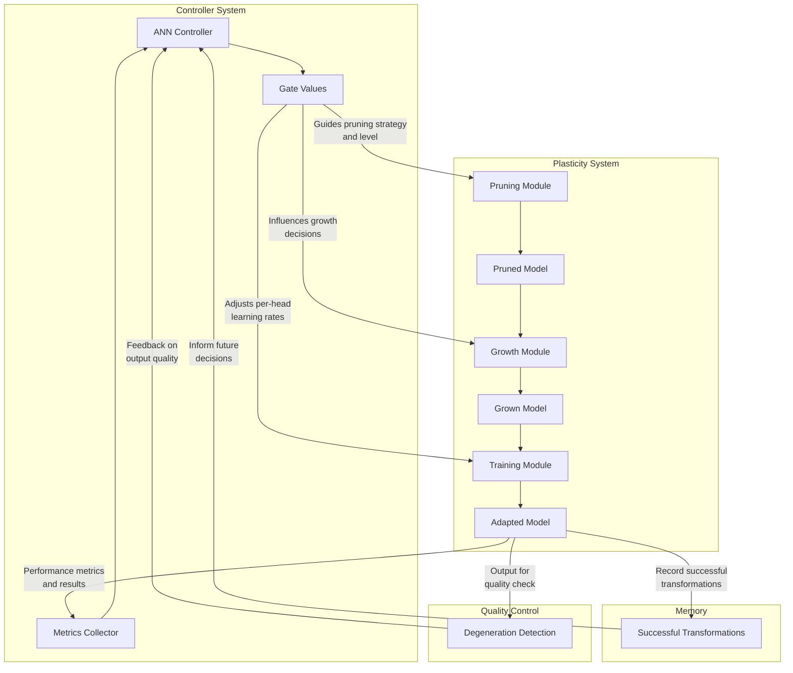

# Controller-Plasticity Integration

This document explains how the ANN Controller and Adaptive Plasticity systems work together to create self-optimizing neural networks that can continuously improve their structure and efficiency.

## Overview

The integration creates a feedback loop between two systems:

1. **ANN Controller**: A neural controller that dynamically adjusts attention head gates based on metrics
2. **Adaptive Plasticity System**: A system that prunes, grows, and fine-tunes the model structure based on detected needs

These systems together create a powerful self-optimizing neural architecture that can:
- Automatically identify and prune less important heads
- Strategically regrow heads based on needs and metrics
- Continuously learn from past optimization decisions
- Dynamically adjust its structure through feedback from the controller

## Architecture

The controller-plasticity integration follows a cyclical process:



## How It Works

### 1. Controller Guidance Phase
The controller analyzes the model's metrics and recommends:
- Which heads to prune (based on entropy, gradient signals)
- How aggressive the pruning should be
- Which areas might benefit from head regrowth
- Optimal learning rates for different heads

### 2. Plasticity Cycle
Using the controller's guidance, the plasticity system:
- Prunes heads according to the recommended strategy and level
- Measures the impact on model performance
- Grows new heads strategically in areas that need them
- Fine-tunes the model with differential learning rates

### 3. Feedback Integration
The results of the plasticity cycle feed back to the controller:
- Successful strategies are reinforced
- Failed strategies are downweighted
- Controller learns from the plasticity system's results
- Memory of effective transformations builds up over time

## System Components

### Controller System
- **ANNController**: Manages gates for all attention heads
- **ControllerManager**: Coordinates controller updates and metrics
- **Head Metrics Collection**: Gathers entropy, gradient, and attention metrics

### Plasticity System
- **AdaptivePlasticitySystem**: Manages the entire plasticity cycle
- **Pruning Strategies**: Multiple strategies for identifying heads to prune
- **Growth Strategies**: Methods for strategic head regrowth
- **Degeneration Detection**: Monitors output quality for degradation
- **Memory System**: Remembers successful transformations

## Technical Details

### Pruning Mechanism
The pruning mechanism uses controller gate values to identify heads for pruning:
```python
pruning_level = min(0.8, pruned_percent / 100 + 0.1)  # Convert from controller to plasticity format
```

### Growth Mechanism
The growth system adapts based on previous cycle success:
```python
if previous_success:
    # If previous cycle was successful, be more conservative with growth
    growth_ratio = 0.3
else:
    # If previous cycle failed, be more aggressive with growth
    growth_ratio = 0.7
```

### Learning Feedback
The controller receives feedback about the effectiveness of its decisions:
```python
integrated_metrics = {
    "perplexity_improvement": torch.tensor(perplexity_improvement),
    "head_reduction": torch.tensor(head_reduction),
    "cycle_success": torch.tensor(1.0 if cycle_success else 0.0),
    "controller_lr": torch.tensor(0.01 * (0.9 ** cycle))
}
```

## Usage

### Command Line Usage

To run the integrated system:

```bash
python scripts/controller_plasticity_integration.py --model_name distilgpt2 --dataset tiny_shakespeare
```

Additional parameters:
- `--max_cycles`: Maximum plasticity cycles to run
- `--learning_rate`: Base learning rate for training
- `--controller_lr`: Learning rate for controller updates
- `--device`: Computing device (cuda/cpu)
- `--verbose`: Enable detailed logging

### Programmatic Usage

The integration can also be used programmatically:

```python
from scripts.controller_plasticity_integration import ControllerPlasticityIntegration
from transformers import AutoTokenizer
from sentinel_data.dataset_loader import load_dataset

# Load tokenizer and dataset
tokenizer = AutoTokenizer.from_pretrained("distilgpt2")
dataset = load_dataset("tiny_shakespeare", tokenizer)

# Configure the integration
controller_config = {
    "controller_type": "ann",
    "controller_lr": 0.01,
    "update_frequency": 50
}

plasticity_config = {
    "learning_rate": 5e-5,
    "max_degeneration_score": 3.0,
    "max_perplexity_increase": 0.15,
    "memory_capacity": 5
}

# Create and run the integration
integration = ControllerPlasticityIntegration(
    model="distilgpt2",
    dataset=dataset,
    max_cycles=5,
    controller_config=controller_config,
    plasticity_config=plasticity_config,
    verbose=True
)

# Run optimization
results = integration.run_integrated_optimization()

# Print results
print(f"Baseline perplexity: {results['baseline_perplexity']:.2f}")
print(f"Final perplexity: {results['best_perplexity']:.2f}")
print(f"Improvement: {results['improvement']*100:.1f}%")
```

## Results Interpretation

The system generates several outputs:
1. **Metrics logs**: Detailed performance at each step
2. **Model checkpoints**: Best model and each cycle's model
3. **Visualization data**: Shows pruning and growth patterns
4. **Results summary**: Overall performance improvements

Example output summary:
```
=== Final Results ===
Baseline perplexity: 24.58
Best perplexity: 18.23
Improvement: 25.8%
Best cycle: 4
Total duration: 42.3 minutes
```

## Integration with upgrayedd.py

The Controller-Plasticity Integration serves as the core engine for the `upgrayedd.py` script, which provides a user-friendly interface for transforming any HuggingFace model into an adaptive, self-optimizing neural network.

To use the integration through upgrayedd.py:

```bash
python scripts/upgrayedd.py --model distilgpt2 --dataset tiny_shakespeare --cycles 5
```

## Neurobiological Parallels

This integrated system mimics several aspects of biological neural plasticity:

1. **Synaptic Pruning**: The controller prunes underutilized connections, similar to how the brain eliminates rarely used synapses
2. **Neurogenesis**: Strategic head growth parallels how the brain grows new connections in response to new stimuli
3. **Hebbian Learning**: "Neurons that fire together, wire together" is implemented through growing heads in areas with high activation correlation
4. **Homeostatic Plasticity**: The feedback loop maintains balanced activity, preventing runaway growth or excessive pruning

## References

1. Frankle, J., & Carbin, M. (2019). The Lottery Ticket Hypothesis: Finding Sparse, Trainable Neural Networks.
2. Michel, P., Levy, O., & Neubig, G. (2019). Are Sixteen Heads Really Better than One?
3. Voita, E., Talbot, D., Moiseev, F., Sennrich, R., & Titov, I. (2019). Analyzing Multi-Head Self-Attention: Specialized Heads Do the Heavy Lifting, the Rest Can Be Pruned.
4. Chen, L., Tian, Y., & Keutzer, K. (2022). Growing and Pruning Neural Networks through Reinforcement Learning.