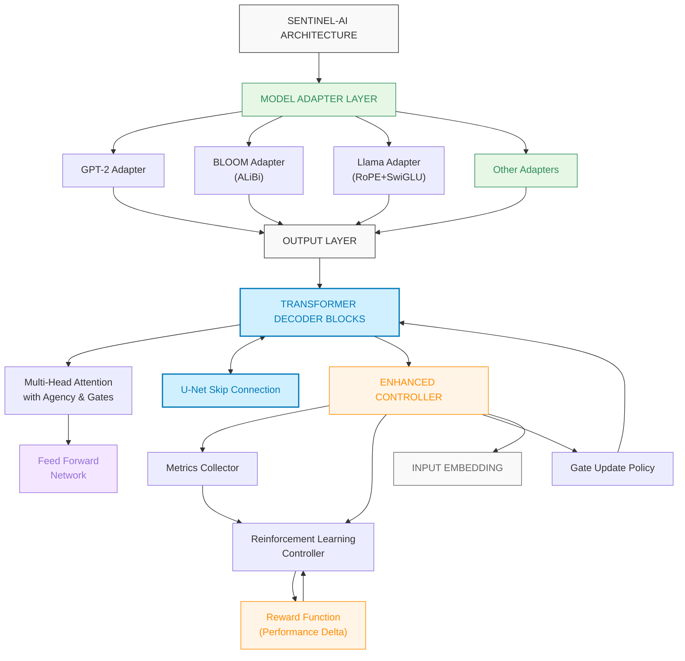
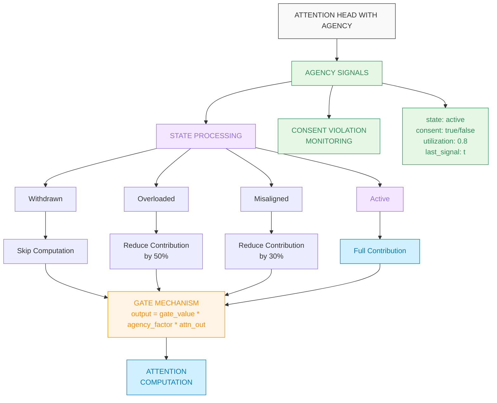
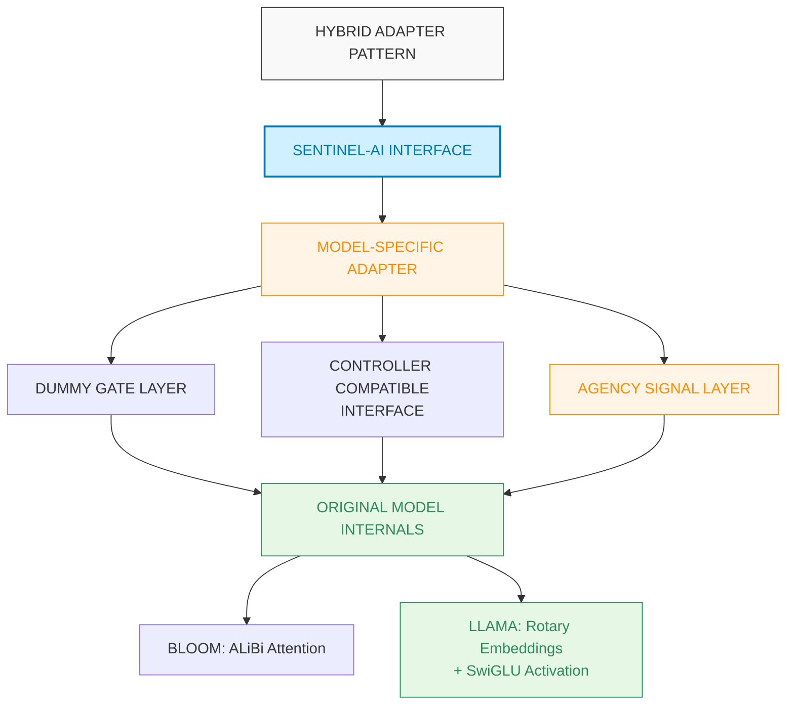
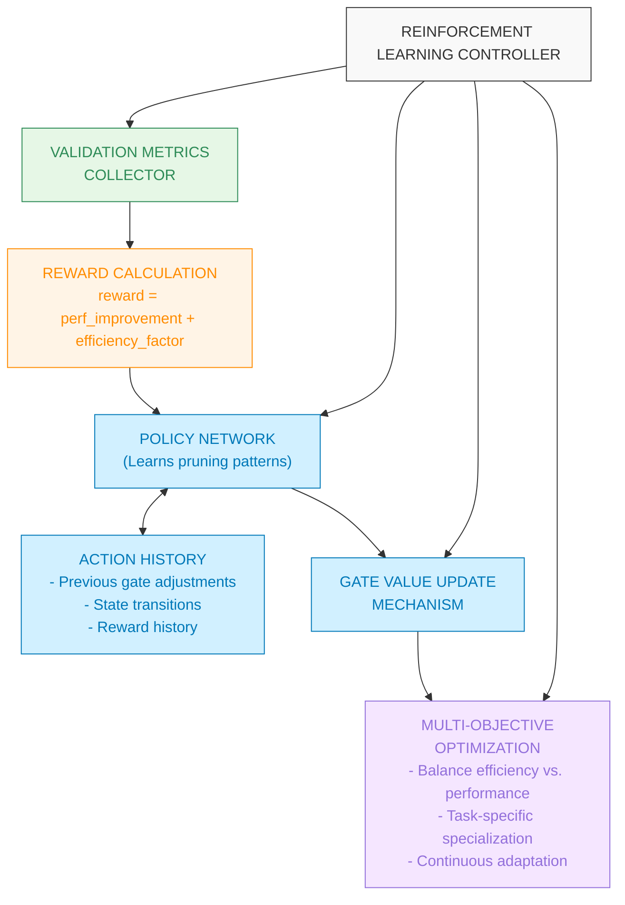
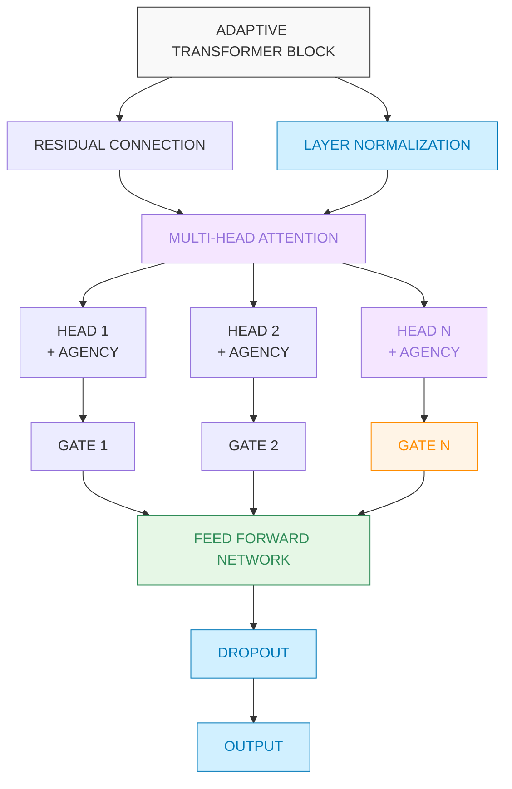
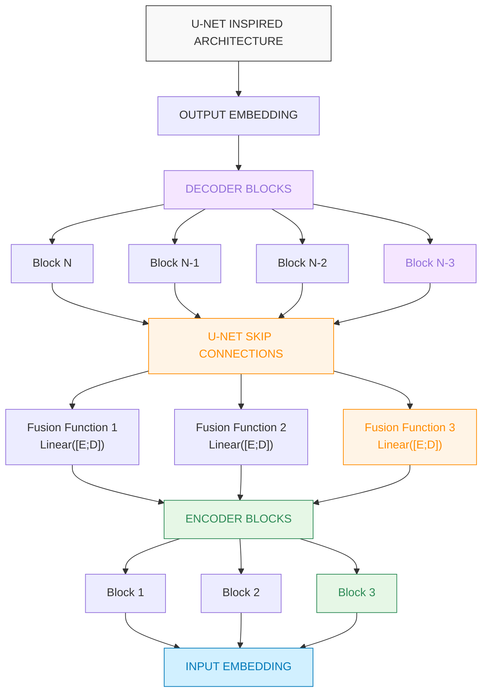

# Main Architecture Diagram

# Attention Head with Agency States

# Hybrid Adapter Architecture

# Enhanced Controller with Feedback System

# Adaptive Transformer Block

# U-Net Skip Connections in Transformer

