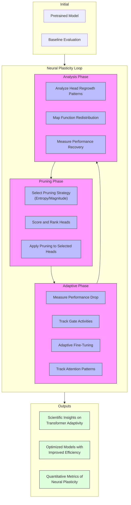

# Neural Plasticity Loop: Pruning and Adaptive Regrowth

This document describes the neural plasticity loop system, which enables the study of how transformer models adapt to structural changes through cycles of pruning, fine-tuning, and monitoring.

## Conceptual Overview

The neural plasticity loop draws inspiration from biological neural development, where synaptic pruning and regrowth processes continually reshape neural connectivity in response to environmental inputs and functional demands.

In our implementation, this cycle involves:

1. **Initial Pruning**: Removing attention heads based on entropy or magnitude criteria
2. **Adaptive Fine-Tuning**: Retraining the pruned model on target data 
3. **Plasticity Tracking**: Monitoring changes in gate activities and attention patterns
4. **Analysis of Regrowth**: Identifying which heads recover and how function is redistributed

This approach allows us to observe how transformer models reorganize their internal representations after targeted disruption, providing insights into functional allocation and resilience.

## System Architecture



## Key Components

### 1. Plasticity Tracker

The `PlasticityTracker` monitors changes in model parameters and behavior through the adaptation process:

```python
class PlasticityTracker:
    def __init__(self, model, tracking_frequency=10):
        self.model = model
        self.tracking_frequency = tracking_frequency
        self.gate_history = {}
        self.attention_history = {}
        self.performance_history = {}
        
    def initialize_tracking(self, pruned_heads):
        """Record the initial state after pruning."""
        self.pruned_heads = pruned_heads
        self.snapshot_gates()
        self.snapshot_attention_patterns()
        
    def snapshot_gates(self):
        """Record current state of all gate values."""
        step = len(self.gate_history)
        self.gate_history[step] = {}
        
        for layer_idx, layer in enumerate(self.model.blocks):
            if hasattr(layer.attn, 'gate'):
                # Deep copy to avoid reference issues
                self.gate_history[step][layer_idx] = layer.attn.gate.detach().clone()
                
    def track_step(self, step, eval_data=None):
        """Track model changes at the current training step."""
        if step % self.tracking_frequency != 0:
            return
            
        # Record gate values
        self.snapshot_gates()
        
        # Optionally record attention patterns
        if eval_data is not None:
            self.snapshot_attention_patterns(eval_data)
            
        # Record performance metrics
        if eval_data is not None and hasattr(self, 'evaluator'):
            metrics = self.evaluator.evaluate(self.model, eval_data)
            self.performance_history[step] = metrics
    
    def analyze_regrowth(self):
        """Analyze which pruned heads have regrown."""
        regrowth_data = {}
        
        # Get initial and final states
        initial_gates = self.gate_history[0]
        final_gates = self.gate_history[max(self.gate_history.keys())]
        
        # Identify regrown heads
        for layer_idx, head_idx, _ in self.pruned_heads:
            if layer_idx in initial_gates and layer_idx in final_gates:
                initial_value = initial_gates[layer_idx][head_idx].item()
                final_value = final_gates[layer_idx][head_idx].item()
                
                # Check if the head has significantly regrown
                if initial_value < 0.1 and final_value > 0.5:
                    regrowth_data[(layer_idx, head_idx)] = {
                        'initial_value': initial_value,
                        'final_value': final_value,
                        'regrowth_ratio': final_value / (initial_value + 1e-10)
                    }
        
        return regrowth_data
```

### 2. Adaptive Fine-Tuner

The `AdaptiveFinetuner` specializes in retraining pruned models with awareness of structural changes:

```python
class AdaptiveFinetuner:
    def __init__(self, model, learning_rate=2e-5, use_differential_lr=True):
        self.model = model
        self.base_lr = learning_rate
        self.use_differential_lr = use_differential_lr
        self.plasticity_tracker = PlasticityTracker(model)
        
    def prepare_optimizer(self, pruned_heads):
        """Create optimizer with adaptive learning rates."""
        if self.use_differential_lr:
            # Group parameters with different learning rates
            pruned_layer_params = []
            other_params = []
            
            for layer_idx, layer in enumerate(self.model.blocks):
                # Check if this layer had pruned heads
                layer_pruned = any(h[0] == layer_idx for h in pruned_heads)
                
                for name, param in layer.named_parameters():
                    if layer_pruned and 'attn' in name:
                        # Higher learning rate for attention in pruned layers
                        pruned_layer_params.append(param)
                    else:
                        other_params.append(param)
            
            # Create parameter groups with different learning rates
            param_groups = [
                {'params': pruned_layer_params, 'lr': self.base_lr * 3.0},
                {'params': other_params, 'lr': self.base_lr}
            ]
            
            return torch.optim.AdamW(param_groups)
        else:
            return torch.optim.AdamW(self.model.parameters(), lr=self.base_lr)
            
    def fine_tune(self, train_dataloader, eval_dataloader, pruned_heads, steps=1000):
        """Fine-tune the model with plasticity tracking."""
        # Initialize tracking
        self.plasticity_tracker.initialize_tracking(pruned_heads)
        
        # Prepare optimizer and scheduler
        optimizer = self.prepare_optimizer(pruned_heads)
        scheduler = torch.optim.lr_scheduler.CosineAnnealingLR(
            optimizer, T_max=steps, eta_min=self.base_lr * 0.1
        )
        
        # Training loop
        self.model.train()
        global_step = 0
        
        for epoch in range(10):  # Maximum of 10 epochs
            if global_step >= steps:
                break
                
            for batch in train_dataloader:
                if global_step >= steps:
                    break
                
                # Forward and backward passes
                # [Training code omitted for brevity]
                
                # Track plasticity
                self.plasticity_tracker.track_step(
                    global_step, 
                    eval_data=next(iter(eval_dataloader)) if global_step % 50 == 0 else None
                )
                
                global_step += 1
        
        # Final tracking snapshot
        self.plasticity_tracker.track_step(global_step, next(iter(eval_dataloader)))
        
        # Analyze regrowth patterns
        regrowth_data = self.plasticity_tracker.analyze_regrowth()
        
        return {
            'regrowth_data': regrowth_data,
            'gate_history': self.plasticity_tracker.gate_history,
            'performance_history': self.plasticity_tracker.performance_history
        }
```

### 3. Plasticity Experiment Runner

The `PlasticityExperiment` class orchestrates full experiments with the neural plasticity loop:

```python
class PlasticityExperiment:
    def __init__(self, model_name, dataset, output_dir, device='cuda'):
        self.model_name = model_name
        self.dataset = dataset
        self.output_dir = output_dir
        self.device = device
        
        # Create output directory
        os.makedirs(output_dir, exist_ok=True)
        
    def run_experiment(self, pruning_strategies=['entropy', 'magnitude'], 
                       pruning_levels=[0.1, 0.3, 0.5],
                       fine_tuning_steps=500,
                       plasticity_cycles=1):
        """Run a complete plasticity experiment."""
        # Load model
        model = load_adaptive_model(self.model_name, device=self.device)
        tokenizer = AutoTokenizer.from_pretrained(self.model_name)
        
        # Prepare data
        train_dataloader, eval_dataloader = self._prepare_data(tokenizer)
        
        # Baseline evaluation
        baseline_metrics = self._evaluate_model(model, eval_dataloader)
        
        results = {
            'model': self.model_name,
            'baseline_metrics': baseline_metrics,
            'cycles': {}
        }
        
        # Run experiments for each strategy and level
        for strategy in pruning_strategies:
            results[strategy] = {}
            
            for level in pruning_levels:
                print(f"Running plasticity experiment: {strategy} pruning at {level} level")
                
                # Clone model to avoid interference
                cycle_model = load_adaptive_model(self.model_name, device=self.device)
                
                cycle_results = []
                
                # Run multiple plasticity cycles
                for cycle in range(plasticity_cycles):
                    # Pruning phase
                    pruned_heads = self._apply_pruning(cycle_model, strategy, level, eval_dataloader)
                    
                    # Immediate post-pruning evaluation
                    post_pruning_metrics = self._evaluate_model(cycle_model, eval_dataloader)
                    
                    # Fine-tuning phase with plasticity tracking
                    fine_tuner = AdaptiveFinetuner(cycle_model)
                    adaptation_results = fine_tuner.fine_tune(
                        train_dataloader, 
                        eval_dataloader, 
                        pruned_heads, 
                        steps=fine_tuning_steps
                    )
                    
                    # Final evaluation
                    final_metrics = self._evaluate_model(cycle_model, eval_dataloader)
                    
                    # Record cycle results
                    cycle_results.append({
                        'pruned_heads': [(l, h, s) for l, h, s in pruned_heads],
                        'post_pruning_metrics': post_pruning_metrics,
                        'final_metrics': final_metrics,
                        'regrowth_data': adaptation_results['regrowth_data'],
                        'recovery_rate': (final_metrics['perplexity'] - post_pruning_metrics['perplexity']) / 
                                        (post_pruning_metrics['perplexity'] - baseline_metrics['perplexity'] + 1e-10)
                    })
                
                # Save results for this strategy and level
                results[strategy][str(level)] = cycle_results
                
                # Save visualizations
                self._generate_visualizations(
                    strategy, 
                    level, 
                    cycle_results,
                    adaptation_results['gate_history']
                )
        
        # Save complete results
        with open(os.path.join(self.output_dir, 'plasticity_results.json'), 'w') as f:
            json.dump(results, f, indent=2)
            
        return results
```

## Experimental Insights

The neural plasticity loop enables investigation of several key scientific questions:

### 1. Head Regrowth Patterns

By tracking which pruned heads recover activity during fine-tuning, we can identify:

- **Critical functions**: Heads that consistently regrow likely serve essential functions
- **Redundant systems**: Functions that redistribute across multiple heads
- **Specialization zones**: Areas of the model that resist permanent pruning

### 2. Adaptation Efficiency

By measuring how quickly performance recovers after pruning, we can quantify:

- **Plasticity capacity**: How efficiently the model can reorganize to compensate for pruning
- **Task sensitivity**: Which tasks are more resilient or vulnerable to structural changes
- **Architecture efficiency**: Whether certain architectures adapt more efficiently than others

### 3. Functional Redistribution

By analyzing attention pattern changes before and after the plasticity cycle:

- **Function migration**: How attention patterns shift to new heads after pruning
- **Specialization emergence**: Whether new specialized attention patterns develop
- **Information distribution**: How the model redistributes its internal representations

## Integration with Existing System

The neural plasticity loop builds on the scientific pruning framework and integrates with:

1. **Pruning Strategies**: Uses the existing entropy and magnitude pruning implementation
2. **Benchmark System**: Leverages the evaluation infrastructure for consistent measurement
3. **Visualization Tools**: Extends existing visualization capabilities for plasticity analysis

This integration creates a complete experimental pipeline for investigating transformer models' adaptive properties while maintaining compatibility with the broader Sentinel-AI system.