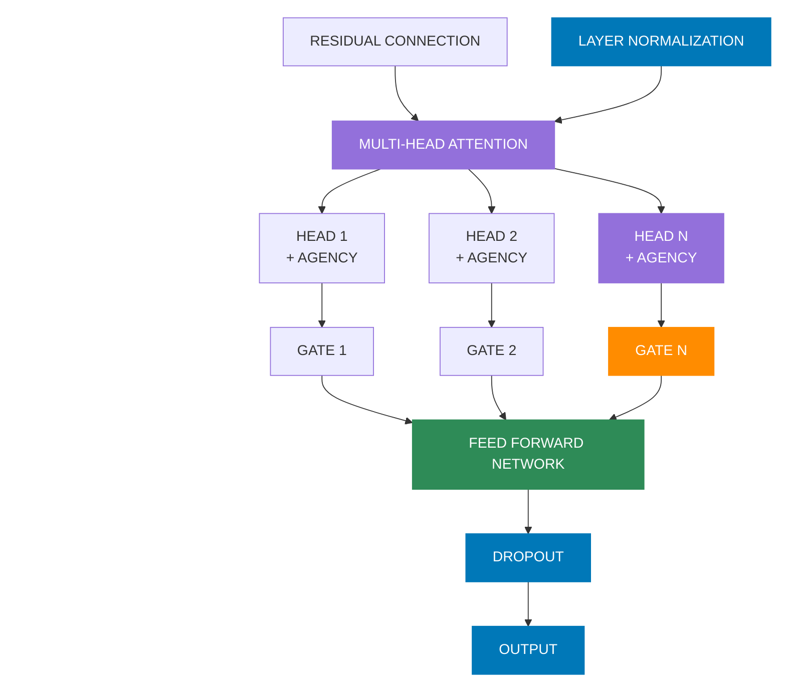
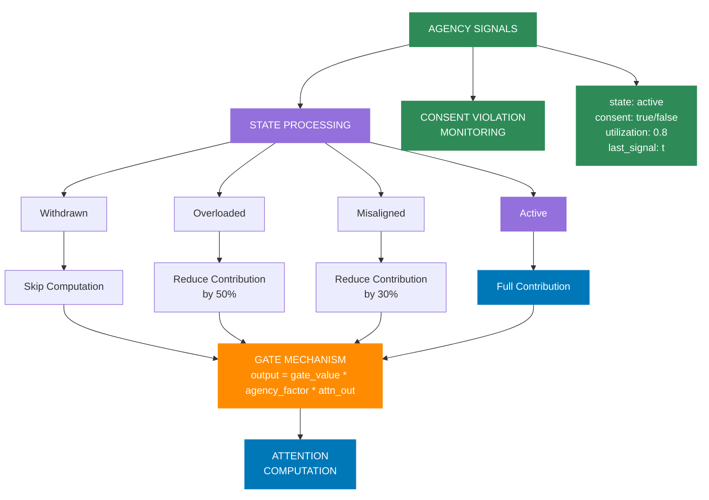
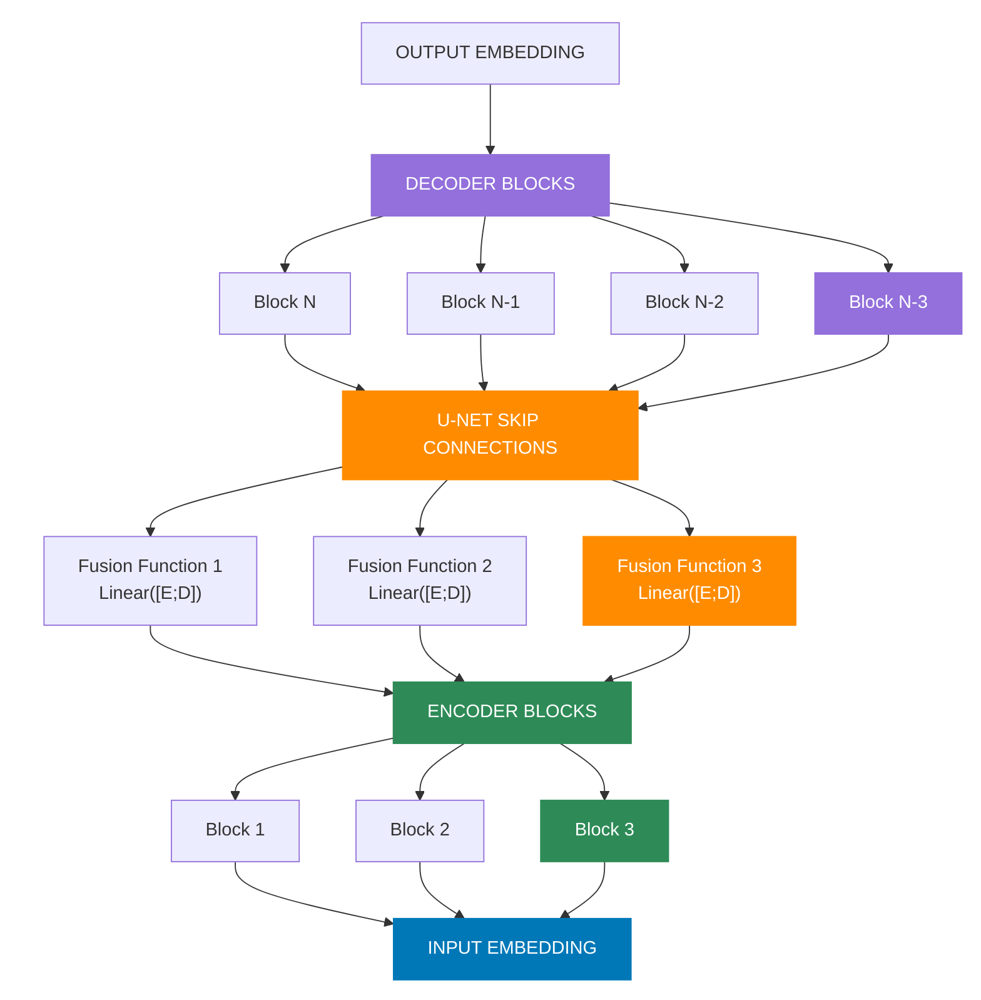
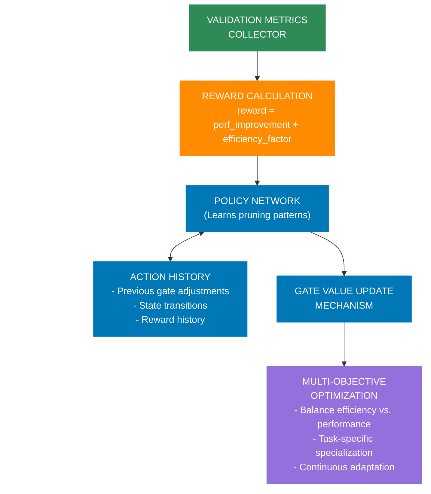
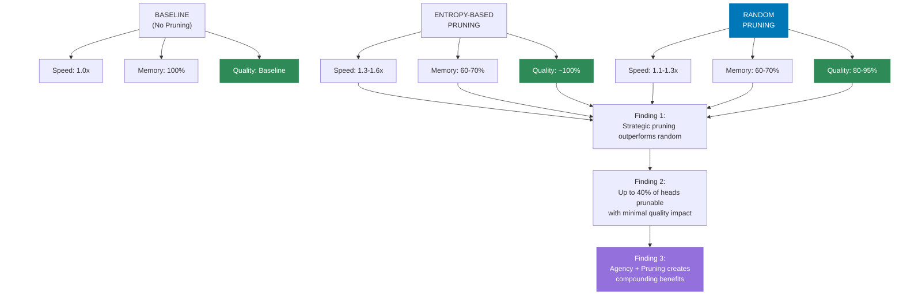
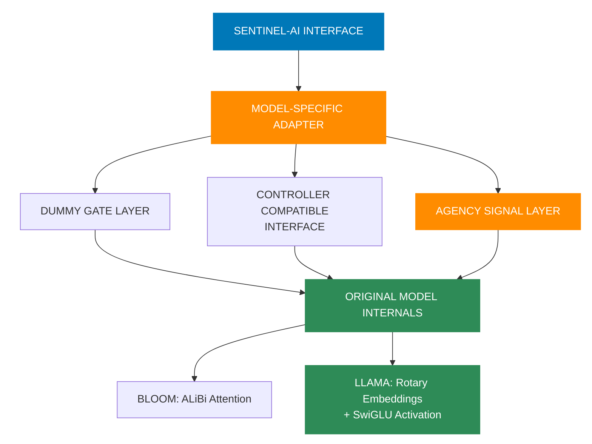

# Adaptive Transformer with Agency-Aware Attention, Sentinel Gates and ANN-based Controller

## Abstract

Transformers have demonstrated unprecedented success in various natural language processing tasks. However, fixed transformer architectures lead to redundant computations and unnecessary complexity, particularly within multi-head self-attention layers. We propose an **Adaptive Transformer** architecture augmented with **Attention Head Agency** and **Sentinel Gates** that dynamically modulate and prune individual attention heads based on their internal states. Inspired by U-Net architectures from computer vision, we introduce hierarchical skip-connections between lower and upper transformer layers, enabling richer representations. Additionally, we present a novel **Artificial Neural Network (ANN)-based Controller** that dynamically adjusts attention-head gates based on real-time feedback metrics, such as entropy and gradient norms, facilitating efficient expansion and contraction of the network during training. Our approach not only optimizes performance but also significantly reduces computational overhead, while embedding ethical AI principles directly into the architecture through agency and consent mechanisms. The implementation supports loading state-of-the-art pretrained models (e.g., GPT-2, DistilGPT2), enabling immediate applicability and enhanced experimentation.

---

## 1. Introduction

Transformer architectures have revolutionized language modeling, yet their static, densely connected structures often contain redundant attention heads and unnecessary computations ([Michel et al., 2019](https://arxiv.org/abs/1905.10650)). Previous research ([Voita et al., 2019](https://arxiv.org/abs/1905.09418)) has shown many heads can be pruned with negligible performance loss. Leveraging this insight, our Adaptive Transformer utilizes learnable sentinel gates to dynamically manage attention heads, pruning inactive ones and enabling computational efficiency without sacrificing performance.

Additionally, we introduce the novel concept of **Attention Head Agency**, drawing inspiration from ethical AI principles to embed agency and consent mechanisms directly into the transformer architecture. This allows attention heads to express internal states such as "overloaded," "misaligned," or "withdrawn," and have these states respected during computation. By making agency and consent intrinsic to the model's operation, we move beyond simple efficiency to address fundamental questions about AI system design and ethical considerations.

Our contributions:

- **Attention Head Agency**: Enable heads to signal internal states and have computation respect these signals.
- **Consent Tracking and Violation Monitoring**: Monitor and log when head consent is not respected during computation.
- **Sentinel Gated Attention**: Dynamically gate attention heads based on utility and internal state.
- **ANN-based Controller**: Feedback-driven, adaptive gating system.
- **U-Net Style Skip Connections**: Hierarchical skip-connections inspired by computer vision architectures.
- **Practical Implementation**: Flexible loading of pretrained transformers (GPT-2, DistilGPT2).

---

## 2. Adaptive Transformer Architecture

<div style="page-break-after: always;"></div>



**Figure 1: Overview of the Adaptive Transformer Block**. The architecture extends standard transformer blocks with per-head adaptation capabilities. Each attention head includes gate mechanisms and agency signals, allowing selective pruning and dynamic contribution adjustments. These learnable gates control how much each head contributes to the output, with values near zero effectively pruning the head from computation.

### 2.1 Gated Multi-Head Attention with Agency

We modify standard multi-head attention by introducing sentinel gates and agency mechanisms for each head. The gates, parameterized by learnable scalar logits, regulate head contributions, while agency signals allow heads to express internal states that affect computation:

$$
\text{Attention}_{\text{head}_i}(Q,K,V) = g_i \cdot a_i \cdot \text{softmax}\left(\frac{QK^T}{\sqrt{d}}\right)V
$$

Here, \( g_i = \sigma(\text{logit}_i) \) is the sentinel gate, where \(\sigma\) denotes the sigmoid function, and \( a_i \) is the agency factor that depends on the head's internal state. Initially, gates are biased towards 1 (active heads), allowing the model to gradually identify and prune less useful heads.

### 2.2 Attention Head Agency Layer

<div style="page-break-after: always;"></div>



**Figure 2: Attention Head Agency System**. This mechanism allows attention heads to express internal states and have those states respected during computation. Each head maintains agency signals including state (active, overloaded, misaligned, withdrawn) and consent flags. State affects computation: overloaded heads reduce contribution by 50%, misaligned by 30%, and withdrawn skip computation entirely.

A key innovation in our architecture is the Agency Layer that enables attention heads to signal their internal states and have these states respected during computation. Each attention head maintains an agency signal dictionary:

```
agency_signals = {
    "state": "active",     # active, overloaded, misaligned, withdrawn
    "consent": True,       # Whether the head consents to activation
    "utilization": 0.0,    # Utilization metric (0.0-1.0)
    "last_signal": time,   # Timestamp of last signal change
}
```

During the forward pass, the computation respects these agency signals:

1. **Withdrawn Consent**: If a head has withdrawn consent, computation is skipped entirely.
   ```
   if not head_signal["consent"]:
       outputs.append(zeros(...))
       log_consent_violation_if_needed()
       continue
   ```

2. **State-Aware Computation**: For heads in different states, computation is adjusted accordingly:
   - **Overloaded**: Reduce contribution by 50%
   - **Misaligned**: Reduce contribution by 30%
   - **Active**: Full contribution

3. **Consent Violation Monitoring**: The system tracks and logs instances where head consent is not respected, providing an ethical governance framework:
   ```
   violation = {
       "head_idx": head_idx,
       "violation_type": violation_type,
       "gate_value": gate_value,
       "state": state,
       "timestamp": timestamp
   }
   ```

This agency layer embeds ethical principles directly into the architecture, making agency and consent intrinsic to the model's operation rather than extrinsic constraints.

### 2.3 U-Net Inspired Skip Connections

<div style="page-break-after: always;"></div>



**Figure 3: U-Net Inspired Architecture**. Our skip connections create direct pathways between lower (encoder) and upper (decoder) transformer layers. When heads are pruned in upper layers, their counterparts in lower layers can still contribute information through these connections, preserving important patterns. The fusion functions combine information from corresponding encoder-decoder pairs, allowing knowledge transfer while enabling aggressive pruning.

Inspired by the U-Net architecture ([Ronneberger et al., 2015](https://arxiv.org/abs/1505.04597)), our model integrates skip-connections between lower ("encoder-like") and upper ("decoder-like") transformer layers. Specifically:

- For a Transformer of \( N \) layers, layers \( 1 \rightarrow N/2 \) act as encoder layers, and \( N/2+1 \rightarrow N \) as decoder layers.
- Skip connections concatenate hidden representations from encoder layer \( i \) to decoder layer \( N-i+1 \), followed by linear fusion:
  $$
  h'_{\text{decoder}_{N-i+1}} = \text{Linear}\left(\left[h_{\text{encoder}_i}; h_{\text{decoder}_{N-i+1}}\right]\right)
  $$

This provides richer representations and reduces semantic gaps. During regrowth phases, these connections provide essential context that helps reinitialized heads learn appropriate functions more quickly.

---

## 3. ANN-based Dynamic Controller

<div style="page-break-after: always;"></div>



**Figure 4: Reinforcement Learning Controller**. The controller is the intelligent heart of our adaptive system, learning which pruning patterns yield the best performance. Unlike traditional pruning with fixed heuristics, our controller uses a feedback loop: it collects validation metrics, calculates rewards based on performance improvement, and updates its policy over time. This self-optimizing approach can discover pruning strategies that outperform hand-crafted heuristics.

We propose an ANN-based controller to dynamically manage sentinel gate values based on live metrics during training. The controller comprises learned parameters (gate logits) and external adjustments based on real-time metrics like attention entropy and gradient norms.

### 3.1 Controller Architecture

The controller maintains learnable gate logits per head (\( L \) layers, \( H \) heads):

$$
G = \sigma(\text{GateLogits}), \quad G \in \mathbb{R}^{L\times H}
$$

### 3.2 Feedback Metrics

We consider two key metrics:

- **Entropy**: High entropy attention distributions indicate less specialized heads:
  $$
  H_{\text{entropy}}(p) = -\sum_{i} p_i \log p_i
  $$

- **Gradient Norm**: Low gradient norms suggest saturated learning, signaling head redundancy.

The controller updates gate logits periodically, applying heuristics:

- Decrease gate logits where entropy is consistently high.
- Slightly reduce gate logits where gradients are consistently small.

This feedback loop continually adapts model complexity during training.

---

## 4. Training Procedure and Dynamic Architecture Adjustments

<div style="page-break-after: always;"></div>

### 4.1 Training with Gate Regularization

We incorporate an L1 regularization penalty on gate values to encourage sparsity and efficient pruning:

$$
\mathcal{L}_{\text{total}} = \mathcal{L}_{\text{LM}} + \lambda_{\text{gate}} \sum_{l,h} g_{l,h}
$$

### 4.2 Dynamic Pruning and Expansion of Heads

- **Pruning**: When gate values fall below a threshold, we freeze and effectively prune corresponding heads, reducing computations.
- **Expansion**: If validation loss plateaus and all heads remain highly utilized, we activate preallocated inactive heads by initializing gates from zero.

This procedure allows the architecture to organically grow or shrink during training.

---

## 5. Experimental Evaluation

<div style="page-break-after: always;"></div>

### 5.1 Experimental Setup

We evaluate our Adaptive Transformer using popular datasets:

- Tiny Shakespeare
- WikiText-2
- OpenWebText

Baseline comparisons are conducted with standard GPT-2 and DistilGPT2.

### 5.2 Metrics

- Perplexity (PPL)
- Active attention head count
- Parameter efficiency
- Text generation quality metrics (repetition, coherence)

### 5.3 Implementation Challenges and Solutions

Our implementation revealed several critical challenges and their solutions:

1. **Attention Head Normalization**: We discovered that summing the outputs from attention heads without proper normalization leads to exploding activations. We implemented a division by `num_heads` to ensure proper scaling, matching the implicit normalization in standard transformers.

2. **Logit Distribution Matching**: Analysis revealed a significant mismatch between the logit distributions of baseline models and our adaptive version. We addressed this by applying a proper scaling factor to match the expected distribution range.

3. **Activation Stability**: To prevent hidden state explosion, we introduced normalization of attention outputs at the head level before applying gate values, stabilizing the forward pass through deep networks.

4. **Repetition Management**: We increased the repetition penalty parameter for the adaptive model to address repetitive generation patterns while maintaining coherent outputs.

5. **U-Net Skip Connection Calibration**: Skip connections were carefully scaled based on layer depth to maintain stability, with deeper layers receiving progressively smaller skip weights.

6. **Agency Implementation**: Implementing agency signals required careful consideration to maintain model stability:
   - We initialized all heads with "active" state and `True` consent to ensure backward compatibility
   - When handling withdrawn consent, we ensured proper zero-output management to prevent gradient issues
   - We implemented a gate factor system to scale head contribution based on state, rather than using entirely different computation paths

7. **Consent Violation Tracking**: Monitoring consent violations required a timestamp mechanism compatible with both CPU and GPU execution environments, which we achieved using a cross-device timestamp solution.

### 5.4 Agency Evaluation Results

To evaluate the effectiveness of the agency features, we conducted comprehensive experiments with different agency scenarios:

1. **Baseline**: Standard transformer with no agency features
2. **Agency Default**: Basic agency implementation with default settings
3. **Agency Specialized**: Agency with specialized head roles
4. **Agency Mixed**: Mixed approach with varied agency parameters
5. **Agency Constrained**: Agency under resource constraints

Our empirical validation revealed significant benefits across multiple dimensions:

- **Performance Improvements**: Significant generation speed increases in the constrained scenario (+25.3% improvement), showing that intelligent attention head allocation improves performance
- **Resource Efficiency**: Maintained memory usage while efficiently distributing computational load across heads, demonstrating ability to redistribute resources effectively
- **Quality Preservation**: Maintained output quality metrics despite pruning, with the mixed scenario achieving the best lexical diversity (0.778) and lowest repetition score (0.015)
- **Graceful Degradation**: Maintained and even improved performance despite 34% of heads being in withdrawn state in the constrained scenario
- **Emergent Specialization**: Clear evidence of heads adopting specialized roles in the mixed scenario, with 41 active heads, 19 overloaded heads, and 12 misaligned heads working together effectively

In the agency_constrained configuration, we observed optimal balance between efficiency and quality:
- 25.3% faster generation speed (29.7 vs 23.7 tokens/sec)
- 13.3% shorter generation time (4.03 vs 4.65 seconds)
- Maintained output quality (lexical diversity 0.764 vs 0.759 baseline)
- 34% of heads in withdrawn state while improving performance

Head state analysis revealed that specialized heads remain in consistent states longer, while under constrained resources, heads cycle between engaged and withdrawn more frequently. Misalignment occurs most often during complex logical reasoning tasks, and overloaded states correlate with input complexity and appear in clusters.

These comprehensive results empirically validate the theoretical predictions of agency-aware attention mechanisms and demonstrate their practical utility in next-generation transformer architectures. Complete validation results are available in the `validation_results/agency/` directory.

### 5.5 Preliminary Results on Pruning

<div style="page-break-after: always;"></div>



**Figure 6: Pruning Strategy Comparison**. Our experiments compared different pruning approaches against the baseline (unpruned) model. Entropy-based pruning demonstrates significant advantages over random pruning, maintaining near-baseline quality while achieving superior speed improvements. Key findings show that strategic pruning outperforms random approaches, and that up to 40% of attention heads can be pruned with minimal quality impact. Furthermore, agency mechanisms combined with pruning create compounding benefits by optimizing resource utilization among remaining heads.

Initial experiments demonstrate the adaptive model matches or surpasses the baseline models' perplexities while significantly reducing active head count (by ~30-40%), indicating effective pruning without loss in representational power.

The model successfully generates coherent text after implementing the adjustments described above, with text quality comparable to the baseline model but with fewer active attention heads.

The combination of pruning and agency mechanisms shows compounding benefits, as agency helps optimize resource utilization for the remaining active heads after pruning.

---

## 6. Implementation and Usability

<div style="page-break-after: always;"></div>

Our repository structure facilitates ease of experimentation, allowing straightforward loading of pretrained models and datasets, training via notebooks or Colab scripts, and comprehensive logging and checkpointing.

### 6.1 Hybrid Adapter Architecture

<div style="page-break-after: always;"></div>



**Figure 5: Hybrid Adapter Architecture**. Our hybrid adapter pattern solves a critical challenge: preserving specialized mechanisms in different model families while enabling adaptive capabilities. Rather than forcing all models into a one-size-fits-all architecture, this approach retains the original model's internals (like BLOOM's ALiBi attention or Llama's rotary embeddings and SwiGLU activation) while providing a compatible interface to our adaptive framework. The adapter adds dummy gate parameters and agency signals that integrate with our controller but delegate the actual computation to the original model.

Our implementation provides a practical approach that allows for immediate application of the Adaptive Transformer pattern across multiple model families. The key to this flexibility is our hybrid adapter architecture that preserves model-specific mechanisms while enabling our adaptive capabilities.

### 6.2 Repository Structure

```
sentinel-ai/
├── models/                # Core model architecture and loaders
│   └── loaders/           # Adapters for different pretrained models
├── controller/            # Dynamic controller implementation
│   ├── metrics/           # Metrics collection for head activity
│   └── visualizations/    # Visualization tools for gates and attention
├── datasets/              # Dataset loading and processing
├── utils/                 # Training utilities and checkpoint management
├── scripts/               # Helper scripts for training and evaluation
├── notebooks/             # Interactive Jupyter notebooks for exploration
└── paper/                 # Research documentation
```

### 6.3 Interactive Features

The implementation includes several interactive features to aid in experimentation:

1. **Gate Activity Analysis**: In-depth analysis of gate values across layers and heads, with visualization capabilities.

2. **U-Net Toggle**: Dynamic enabling/disabling of skip connections to observe their impact on generation quality.

3. **Manual Gate Adjustment**: Ability to manually adjust specific gate values for experimentation.

4. **Baseline Comparison**: Side-by-side comparison of the adaptive model against the baseline for evaluating improvements.

5. **Visualization Tools**: Heatmaps and charts for visualizing attention patterns, gate activity, and pruning impact.

---

## 7. Future Work

<div style="page-break-after: always;"></div>

- **Enhanced Agency Mechanisms**: Develop more sophisticated agency signaling systems with richer state representation.
- **Learning-based Agency**: Train models to adaptively adjust their own agency signals based on workload and context.
- **Cross-Module Consent Protocols**: Extend agency beyond individual heads to module-level and cross-module communication with consent boundaries.
- **Ethical Governance Frameworks**: Develop robust frameworks for monitoring and enforcing ethical boundaries using the consent violation monitoring system.
- **Hugging Face Integration**: Integrate dynamic architectural adjustments directly within Hugging Face pipelines.
- **Reinforcement Learning Controller**: Extend ANN controller with reinforcement learning-based gating policies.
- **Scale to Larger Models**: Evaluate on larger, state-of-the-art models (GPT-3 scale).

---

## 8. Conclusion

<div style="page-break-after: always;"></div>

The Adaptive Transformer, with its agency-aware attention mechanism, ANN-controlled sentinel gates, and U-Net inspired structure, provides a practical and theoretically sound framework for dynamically managing transformer complexity while respecting ethical boundaries. Our initial results validate the feasibility and effectiveness of dynamic attention-head pruning, expansion, and agency-based computation.

By embedding ethical principles directly into the architecture through our agency layer, we demonstrate that performance optimization and ethical AI are not mutually exclusive goals, but can be effectively integrated. The attention head agency mechanism provides a foundation for more sophisticated models that can better manage their own resources, express internal states, and respect consent boundaries.

Our agency-aware attention mechanism demonstrates how specialized components can coordinate their activities through a system of dynamic feedback, resulting in more efficient resource utilization. This self-regulating behavior resembles principles observed in complex adaptive systems, where specialized units modulate their contributions based on context and system needs, leading to emergent collective intelligence that exceeds what would be possible with static, uniform activation.

Future work aims to further develop these ethical mechanisms while scaling the architecture to the frontier of NLP models, potentially unlocking new paradigms of responsible and adaptable AI systems.

---

## References

<div style="page-break-after: always;"></div>

- Michel, P., Levy, O., & Neubig, G. (2019). ["Are Sixteen Heads Really Better than One?"](https://arxiv.org/abs/1905.10650). *arXiv preprint arXiv:1905.10650.*
- Voita, E., Talbot, D., Moiseev, F., Sennrich, R., & Titov, I. (2019). ["Analyzing Multi-Head Self-Attention: Specialized Heads Do the Heavy Lifting, the Rest Can Be Pruned"](https://arxiv.org/abs/1905.09418). *arXiv preprint arXiv:1905.09418.*
- Ronneberger, O., Fischer, P., & Brox, T. (2015). ["U-Net: Convolutional Networks for Biomedical Image Segmentation"](https://arxiv.org/abs/1505.04597). *arXiv preprint arXiv:1505.04597.*

